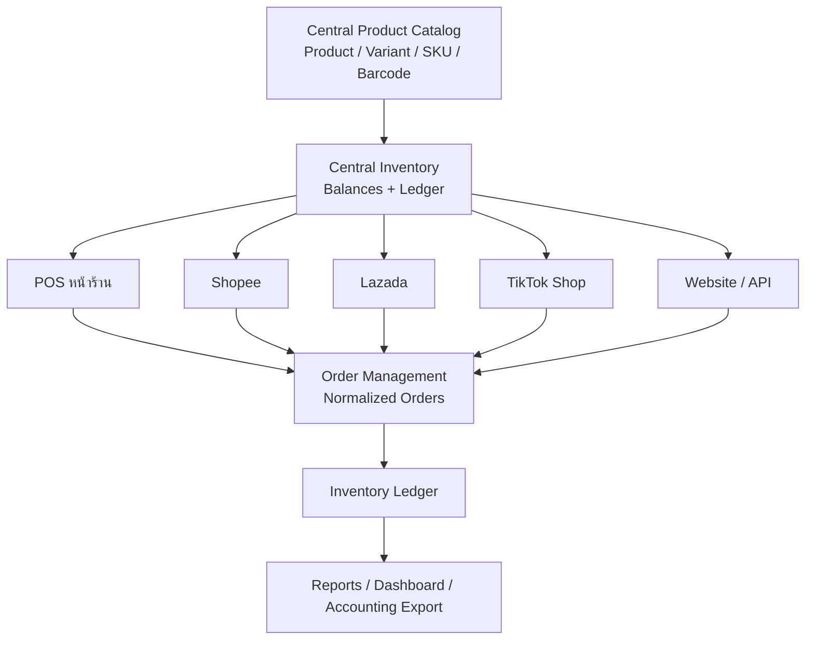
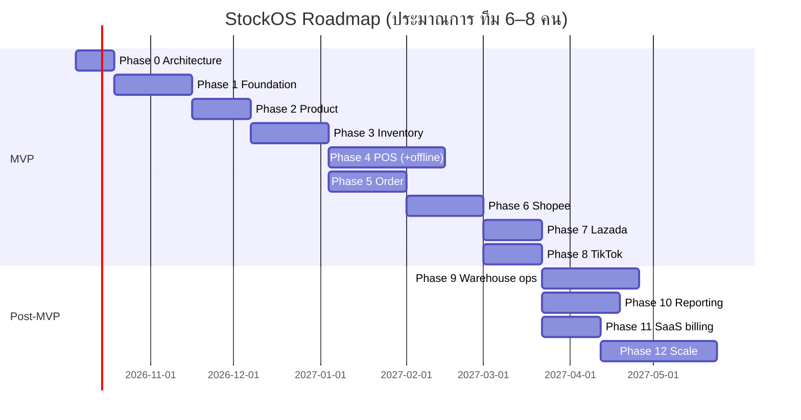

# 01 — Product

## 1. Product Overview

**StockOS** คือ Commerce Operating System สำหรับร้านค้าไทยที่ขายหลายช่องทาง โดยมี **Central Inventory** เป็นหัวใจ



**Value proposition**
1. **ไม่ oversell** — Stock กลางเดียว, reservation, safety stock, sync อัตโนมัติ
2. **ตรวจสอบได้ทุกชิ้น** — ทุกการเปลี่ยน Stock มี ledger ว่า ใคร/ทำไม/ช่องทางไหน/order ไหน
3. **POS ที่เร็วและขายได้แม้เน็ตล่ม**
4. **เห็นภาพรวมธุรกิจ** — ยอดขาย/กำไร/stock ทุกช่องทาง ทุกสาขา ในที่เดียว

**Personas**: เจ้าของร้าน (Owner), ผู้จัดการสาขา, แคชเชียร์, พนักงานคลัง, ฝ่ายจัดซื้อ, บัญชี, การตลาด/แอดมินออนไลน์

## 2. Business Requirements

### Functional (สรุป — รายละเอียดใน Feature List)
| ID | Requirement | Priority |
|---|---|---|
| BR-01 | Multi-tenant: ข้อมูล tenant แยกกันสมบูรณ์ | Must |
| BR-02 | Tenant มีหลายสาขา/คลัง/POS/user/channel/brand/supplier | Must |
| BR-03 | Product catalog พร้อม variant, SKU, barcode ต่อ variant, unit conversion | Must |
| BR-04 | Stock กลางแยก on_hand/reserved/committed/available/damaged/incoming ต่อคลัง | Must |
| BR-05 | ทุกการเปลี่ยน Stock มี ledger ย้อนตรวจได้ และ rebuild balance ได้ | Must |
| BR-06 | กันขายเกิน (overselling) ภายใต้ concurrency | Must |
| BR-07 | POS ขายได้ครบวงจรและขาย offline ได้ | Must |
| BR-08 | Sync order/stock/price กับ Shopee, Lazada, TikTok Shop | Must (Phase 2) |
| BR-09 | Channel stock strategy: GLOBAL_POOL / CHANNEL_ALLOCATION + safety stock | Must (Phase 2) |
| BR-10 | Purchase order, partial receive, supplier | Should (Phase 3) |
| BR-11 | Transfer, adjustment (with approval), stock count | Should (Phase 3) |
| BR-12 | Price list, promotion, coupon, loyalty | Should (Phase 3) |
| BR-13 | Reports + export CSV/Excel/PDF | Must (basic) / Should (full) |
| BR-14 | Subscription plans + usage metering | Must ก่อน GA |

### Non-functional
| ID | Requirement | Target |
|---|---|---|
| NFR-01 | API latency | p95 < 300ms (general), p95 < 150ms (POS scan/lookup), inventory reserve p95 < 100ms |
| NFR-02 | Throughput | 1,000 orders/min (Y1), 10,000 orders/min (Y3) |
| NFR-03 | Availability | 99.9% core API; webhook ingestion 99.95% |
| NFR-04 | Stock correctness | 0 unintended negative stock; ledger ≡ balance (reconcile ทุกคืน) |
| NFR-05 | Channel stock sync latency | p95 < 30s หลัง stock เปลี่ยน (ขึ้นกับ rate limit ของ platform) |
| NFR-06 | Durability | RPO ≤ 5 นาที, RTO ≤ 1 ชม. |
| NFR-07 | Security/Compliance | PDPA, OWASP ASVS L2, audit log ทุก write |
| NFR-08 | POS offline | ≥ 72 ชม., sync ไม่ซ้ำ ไม่หาย |

## 3. User Roles

### System roles (สร้างให้อัตโนมัติทุก tenant, แก้ไขไม่ได้ แต่ clone เป็น custom role ได้)

| Role | ขอบเขต | สิทธิ์หลัก |
|---|---|---|
| **Owner** | ทั้ง tenant | ทุกอย่าง + billing + ลบ tenant + โอน ownership (มีได้ 1 คน) |
| **Admin** | ทั้ง tenant | ทุกอย่างยกเว้น billing/ownership |
| **Manager** | สาขาที่ assign | product/inventory/order/pos/report ของสาขา, approve adjustment/transfer/refund |
| **Warehouse Staff** | คลังที่ assign | inventory.read, receive, transfer, count, pick/pack |
| **Cashier** | POS ที่ assign | pos.sell, pos.hold, customer.create; discount/refund ต้อง manager override |
| **Accountant** | ทั้ง tenant (read) | report.*, order.read, payment.read, export |
| **Purchasing** | ทั้ง tenant | supplier.*, purchase.create, receive (approve ตาม limit) |
| **Marketing** | ทั้ง tenant | promotion.*, coupon.*, price.read, customer.read, channel product listing |
| **Viewer** | ตามที่ assign | *.read เท่านั้น |

### Permission catalog (ใช้ใน code เป็น constant)

```
tenant.manage  billing.manage  user.read  user.manage  role.manage
branch.manage  warehouse.manage  device.manage
product.read  product.create  product.update  product.delete  product.cost.read
price.read  price.manage
inventory.read  inventory.adjust  inventory.adjust.approve  inventory.transfer
inventory.transfer.approve  inventory.receive  inventory.count  inventory.count.approve
order.read  order.create  order.update  order.cancel  order.refund  order.fulfill
pos.sell  pos.discount  pos.discount.override  pos.refund  pos.void  pos.shift.open
pos.shift.close  pos.cash.in_out  pos.reprint
purchase.read  purchase.create  purchase.approve  purchase.receive
supplier.read  supplier.manage
customer.read  customer.manage  customer.pii.read  customer.export
promotion.read  promotion.manage  coupon.manage  loyalty.manage
payment.read  payment.refund
report.read  report.export  report.financial
channel.read  channel.manage  channel.mapping  channel.sync
settings.manage  audit.read  api_key.manage  webhook.manage
```

**Scope**: role assignment = `(user, role, scope_type, scope_id)` โดย `scope_type ∈ {TENANT, BRANCH, WAREHOUSE}` — เช่น Manager ของ Branch Bangkok เท่านั้น
**Limits**: permission บางตัวมี attribute เช่น `pos.discount` max 10%, `purchase.approve` max ฿50,000, `inventory.adjust` max 20 ชิ้นต่อครั้ง (เกินต้อง approve) → เก็บใน `role_permissions.constraints JSONB`
**Custom role**: Owner/Admin สร้างได้ เลือก permission จาก catalog; **ห้ามให้สิทธิ์เกินกว่าที่ตัวเองมี** (privilege escalation guard)

## 4. Complete Feature List

| Module | Features |
|---|---|
| **Auth & Tenant** | Sign-up tenant, email/phone login, 2FA (TOTP), SSO (Enterprise), invite user, session/device mgmt, RBAC + custom role, API keys, audit log |
| **Organization** | Branch, warehouse (+zone/rack/shelf/bin), POS device registration, brand, business settings (VAT, receipt template, doc numbering) |
| **Product Catalog** | Product, variant (option matrix สี/ไซส์), SKU, barcode (EAN-13/UPC-A/Code128/QR), category tree, brand, unit + conversion (ชิ้น/แพ็ค/ลัง), supplier link, images, bulk import/export Excel, bundle/kit, serial/lot (future) |
| **Inventory** | Balances ต่อคลัง, ledger, reservation, adjustment + approval, transfer (partial), stock count (full/cycle/blind), low-stock threshold, reorder point, valuation (MWA), location/bin |
| **POS** | Cashier login (PIN), shift open/close, cash drawer, barcode scan, search, cart, discount/coupon/member, VAT, split payment (cash/card/PromptPay QR), refund/exchange, receipt/reprint, hold/resume, offline mode, customer display |
| **Order Management** | Unified orders จากทุก channel, state machine, fulfillment (pick/pack/ship), partial shipment, cancel, return, refund, dedup |
| **Channel Integration** | Connect Shopee/Lazada/TikTok (OAuth), product import + mapping, order sync (webhook+polling), stock push, price push, allocation strategy, safety stock, reconciliation |
| **Purchasing** | Supplier, PO, approval, partial receive, landed cost (future), cost update |
| **Pricing & Promotion** | Price lists (retail/wholesale/member/VIP/marketplace), scheduled price, promotion engine (%/fixed/BxGy/bundle/tier/free item), coupon, priority/stacking rules |
| **CRM & Loyalty** | Customer profile, merge across channels, points, tier (Silver/Gold/Platinum), reward, member price |
| **Payments** | Payment abstraction, cash, card terminal, PromptPay QR (dynamic via gateway / static EMVCo), bank transfer, refund/partial refund |
| **Reporting** | Dashboard, sales/inventory/movement/valuation/COGS/profit/purchase/supplier/product/channel/cashier/refund/discount/tax report, export CSV/XLSX/PDF, scheduled email |
| **Notification** | Low/out-of-stock, sync failure, token expiry, negative stock, abnormal adjustment → in-app/email/LINE/webhook |
| **SaaS** | Plans, usage metering, limits, billing (Stripe/Omise), trial |
| **Platform Admin** | Tenant mgmt, webhook/sync job console, DLQ retry, remap SKU, force sync, lock tenant, health |
| **AI (future)** | Demand forecast, reorder recommendation, dead stock, anomaly detection, price recommendation |

## 5. MVP Scope

**MVP = Phase 1 (Core + POS) + Phase 2 (Shopee/Lazada/TikTok)** — เพราะ value หลักคือ "stock กลางที่ไม่ oversell ข้ามช่องทาง" ถ้าไม่มี marketplace ยังไม่ใช่ product ที่แข่งได้

### ✅ ต้องทำก่อน (Must, MVP)
- Auth, tenant, user, system roles + permission check (custom role UI ทำ Phase 3 แต่ data model พร้อมตั้งแต่วันแรก)
- Branch, warehouse (ไม่มี bin), POS device
- Product/variant/SKU/barcode/category/brand/unit (conversion แบบง่าย)
- Inventory: balances + ledger + reservation + adjustment (ไม่มี approval workflow — ใช้ permission) + low stock
- POS: sale, cash + PromptPay QR (static) + card (บันทึกยอดจาก EDC แยก), discount (manual), receipt, shift, refund, hold/resume, **offline mode**
- Order management กลาง + state machine
- Customer (basic: ชื่อ/เบอร์/ประวัติซื้อ)
- Channel framework + Shopee + Lazada + TikTok (order sync, stock push, SKU mapping, GLOBAL_POOL + safety stock)
- Webhook inbox, outbox, queue, DLQ, admin retry
- Dashboard + sales/inventory/movement report + CSV export
- Reconciliation job (stock mismatch detection + manual push)
- Audit log, observability, backup

### ⏳ ยังไม่ควรทำ (Not now) — และเหตุผล
| Feature | ทำเมื่อ | เหตุผล |
|---|---|---|
| Microservices / Kafka | > 3,000 orders/min หรือทีม > 25 คน | ค่า operate สูง, ทำลาย transaction consistency โดยไม่จำเป็น |
| Bin-level location / WMS เต็มรูปแบบ | Phase 9 | ร้าน SME ส่วนใหญ่ยังไม่ใช้ |
| FIFO costing / lot / serial / expiry | Phase 9+ | ซับซ้อน, MWA พอสำหรับ SME |
| Full accounting (GL) | ไม่ทำ — integrate แทน (Express, PEAK, FlowAccount, Xero) | ไม่ใช่ core competency |
| Promotion engine ซับซ้อน (stacking, BxGy) | Phase 3 | MVP ใช้ manual discount + % coupon |
| Loyalty tiers | Phase 3 | |
| CHANNEL_ALLOCATION strategy | Phase 2.5 | GLOBAL_POOL + safety stock ครอบคลุม 80% ของลูกค้า |
| AI | Phase 4+ | ต้องมีข้อมูลขายย้อนหลัง ≥ 6 เดือนก่อน |
| Native mobile app | ไม่ทำ — PWA responsive | |
| Multi-currency, multi-language (นอกจาก TH/EN) | ตามลูกค้า | |
| Elasticsearch | > 1M SKU ต่อ tenant หรือ search p95 > 200ms | Postgres `pg_trgm` + FTS พอ |

## 6. Future Roadmap (ภาพรวม — รายละเอียดใน [15-roadmap-and-tasks.md](15-roadmap-and-tasks.md))



Beyond: LINE SHOPPING, Shopify, WooCommerce, e-Tax Invoice, accounting connectors (PEAK/FlowAccount/Xero), franchise mode, B2B wholesale portal, AI forecasting.

## UX Principles (สรุป §46–47)

| Persona | หน้าหลัก | หลักการ |
|---|---|---|
| **Owner** | Dashboard: ยอดขายวันนี้, กำไรขั้นต้น, ยอดแยก channel/สาขา, alert (out-of-stock, sync fail) | ตัวเลขสำคัญ 5 ตัวเห็นใน 1 จอมือถือ; ทุก card กดเจาะลงได้ |
| **Manager** | Today: order รอจัดการ, stock ต่ำ, approval queue, shift status | Action-oriented (inbox) ไม่ใช่ report-oriented |
| **Cashier** | POS จอเดียว: scan → cart → pay → receipt | **Keyboard-first/scanner-first**, ไม่มี modal ที่ไม่จำเป็น, ปุ่ม ≥ 48px, จ่ายเงินสดยอดพอดี 1 tap, ทุก action < 100ms (local-first) |
| **Warehouse** | Mobile: Scan → ดู stock / รับของ / pick / pack / count | ใช้มือเดียว, scan ด้วยกล้องมือถือหรือ Bluetooth scanner, feedback เสียง/สั่น, ทำงาน offline ระหว่าง count |

**POS speed budget**: scan → แสดงใน cart ≤ 50ms (lookup จาก local DB), กด "ชำระ" → พิมพ์ใบเสร็จ ≤ 1.5s, จำนวน tap สำหรับขายเงินสด 1 ชิ้น = scan + 2 tap

**Warehouse flow**: `Scan order/pick list → scan bin/สินค้า (ยืนยันถูกชิ้น) → Pick → Pack (scan ซ้ำ + พิมพ์ label) → Complete (สถานะ PACKED/SHIPPED push ไป channel)`

**Mobile (§47)**: Web responsive + PWA installable; หน้าที่ optimize มือถือ: Stock lookup, Receive PO, Transfer, Count, Pick/Pack, Owner dashboard. ใช้ `BarcodeDetector` API / ZXing-wasm fallback สำหรับกล้อง
