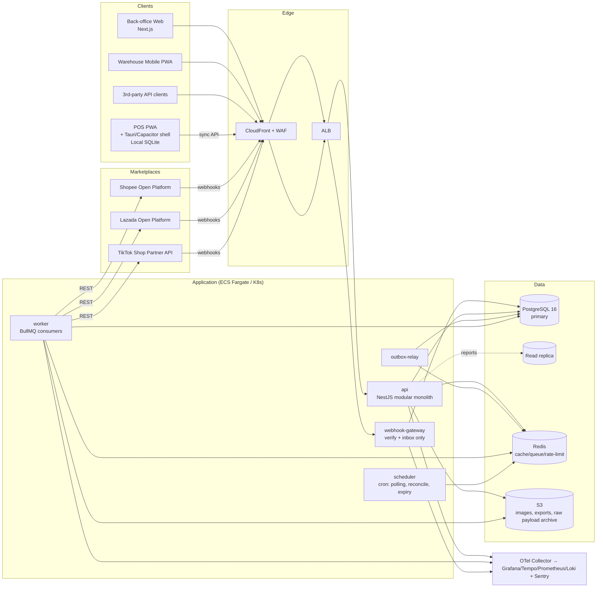
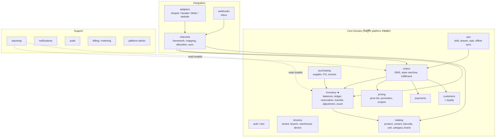
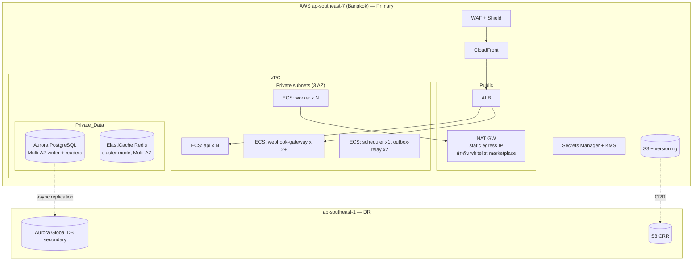

# 02 — Architecture

## 7. System Architecture



**Process types** (โค้ดชุดเดียว, entrypoint ต่างกัน):
| Process | หน้าที่ | Scale ด้วย |
|---|---|---|
| `api` | HTTP API (back-office, POS sync, public API) | CPU / RPS |
| `webhook-gateway` | รับ webhook: verify signature → insert `webhook_events` → 200 | RPS (แยกเพื่อไม่ให้ API ช้าแล้ว webhook หลุด) |
| `worker` | ประมวลผล queue: webhook processing, channel sync, notifications, reports | Queue depth (KEDA / ECS step scaling) |
| `outbox-relay` | อ่าน `outbox_events` (FOR UPDATE SKIP LOCKED) → publish ไป queue | 1–2 instances |
| `scheduler` | Cron jobs (leader election ผ่าน Postgres advisory lock) | 1 active |

## 8. Module Architecture



**กฎ dependency**
1. Module A เรียก Module B ผ่าน `B/public-api.ts` (facade service + DTO) เท่านั้น — บังคับด้วย `eslint-plugin-boundaries`
2. ห้าม query table ของ module อื่นตรง ๆ (ยกเว้น `reporting` ที่อ่านจาก replica/read models)
3. `inventory` ไม่ depend กับ `orders` — orders เรียก inventory; inventory แจ้งกลับผ่าน domain event
4. `adapters/*` implement `ChannelAdapter` interface จาก `channels`; core ไม่ import adapter ใด ๆ (ลงทะเบียนผ่าน `AdapterRegistry`)

**Module internal layering** (ทุก module เหมือนกัน):
```
modules/inventory/
  public-api.ts            # facade ที่ module อื่นใช้ได้
  domain/                  # entities, value objects, state machines, domain errors (pure TS, no Nest)
  application/             # use cases / command handlers (orchestrate tx)
  infrastructure/          # repositories (SQL), queue producers
  http/                    # controllers, DTO validation (zod)
  events/                  # event definitions + handlers
  inventory.module.ts
```

## 36. Recommended Technology Stack

| Layer | เลือก | เหตุผล | ทางเลือกที่ไม่เลือก |
|---|---|---|---|
| Language | **TypeScript** ทั้ง stack | ทีมเดียวทำได้ทั้ง FE/BE/POS, share types/validation | Go (เร็วกว่าแต่แยกภาษา FE/BE) |
| Backend framework | **NestJS + Fastify adapter** | DI + module system เหมาะ modular monolith, Fastify เร็วกว่า Express ~2x | Pure Fastify (ต้องสร้าง structure เอง) |
| Validation | **zod** (shared กับ FE) + `nestjs-zod` | schema เดียวใช้ทั้ง client/server/OpenAPI | class-validator |
| DB access | **Kysely** (type-safe SQL builder) + raw SQL สำหรับ inventory hot path | ควบคุม SQL/lock ได้เต็มที่, ไม่มี ORM magic | Prisma (คุม `FOR UPDATE`/`SKIP LOCKED`/RLS session ยาก), TypeORM |
| Migrations | **SQL files** + `graphile-migrate` หรือ `dbmate` | migration เป็น SQL ตรง review ง่าย | ORM auto-migration |
| Database | **PostgreSQL 16** (RDS/Aurora) | ACID, row lock, RLS, partitioning, JSONB, pg_trgm | MySQL (ไม่มี RLS), Mongo |
| Cache / Lock / Rate limit | **Redis 7** (ElastiCache) | BullMQ, token bucket, cache | — |
| Queue (MVP) | **BullMQ** on Redis | ง่าย, delayed/retry/backoff/priority/rate-limit ในตัว, dashboard | ดูตารางเปรียบเทียบใน [07](07-async-and-events.md) |
| Queue (Scale) | **SQS** (job queue) + **Kafka/MSK** หรือ EventBridge (event stream) | durable, managed | RabbitMQ (ต้อง operate เอง) |
| Back-office FE | **Next.js 15 (App Router)** + TanStack Query + shadcn/ui + Tailwind | SSR สำหรับ dashboard, ecosystem ใหญ่ | — |
| POS | **React + Vite PWA** + **SQLite WASM (OPFS)** / Dexie fallback; shell: **Tauri** (Win/mac), **Capacitor** (Android/iPad) | offline-first, hardware access ผ่าน native plugin | Electron (หนัก 150MB+), React Native (โค้ด UI แยก) |
| Object storage | **S3** (MinIO local) | | |
| Search | Postgres FTS + `pg_trgm` → **OpenSearch** เมื่อ > 1M SKU/tenant | ลด infra ช่วงแรก | |
| Auth | Built-in (argon2id + JWT access 15m + opaque refresh rotation) ; SSO ผ่าน WorkOS/Keycloak (Enterprise) | ควบคุม multi-tenant claim ได้เต็มที่ | Auth0/Cognito (ค่าใช้จ่ายต่อ MAU สูงเมื่อมี cashier จำนวนมาก) |
| Observability | **OpenTelemetry** → Grafana stack (Tempo, Loki, Prometheus/Mimir) + **Sentry** | vendor-neutral | Datadog (แพงเมื่อ scale) |
| Infra as Code | **Terraform** + GitHub Actions | | |
| Runtime | **AWS ECS Fargate** (MVP) → EKS เมื่อ > 30 services/ต้องการ KEDA | Fargate operate ง่ายที่สุด | |
| Monorepo | **pnpm workspaces + Turborepo** | cache build, share packages | Nx |
| Testing | Vitest, embedded PostgreSQL 16 (Postgres จริง ไม่ต้องใช้ Docker), Playwright, k6 | | |

## 37. Project Folder Structure

```
stockos/
├── apps/
│   ├── api/                      # NestJS entry: HTTP API
│   │   └── src/main.ts
│   ├── webhook-gateway/          # NestJS (Fastify) entry: รับ webhook เท่านั้น
│   ├── worker/                   # BullMQ consumers entry
│   ├── scheduler/                # cron entry
│   ├── outbox-relay/
│   ├── web/                      # Next.js back-office + warehouse mobile PWA
│   └── pos/                      # React PWA (Vite) + src-tauri/ + android/ (Capacitor)
├── packages/
│   ├── core/                     # ★ backend domain modules (Nest modules)
│   │   └── src/modules/
│   │       ├── auth/  tenancy/  catalog/  inventory/  orders/  pos/
│   │       ├── pricing/  customers/  payments/  purchasing/
│   │       ├── channels/         # ChannelAdapter interface, registry, mapping, allocation, sync
│   │       ├── webhooks/  reporting/  notifications/  audit/  billing/  platform-admin/
│   ├── integrations/
│   │   ├── shopee/               # implements ChannelAdapter (ไม่มี business logic)
│   │   ├── lazada/
│   │   ├── tiktok/
│   │   ├── website/
│   │   └── payment-providers/    # opn/, 2c2p/, promptpay-static/
│   ├── database/                 # Kysely types (generated), migrations/, seeds/, tx helpers, RLS session
│   ├── contracts/                # zod schemas + DTO + event types (shared FE/BE/POS)
│   ├── shared/                   # money (decimal.js), errors, ids (uuidv7), result, logger, clock
│   ├── queue/                    # BullMQ wrappers, outbox, idempotent consumer base
│   ├── pos-engine/               # pure TS: cart, pricing calc, VAT, promo eval (ใช้ทั้ง POS และ server)
│   ├── hardware/                 # HardwareBridge interface + ESC/POS encoder
│   ├── ui/                       # shared React components
│   └── config/                   # eslint, tsconfig, prettier presets
├── db/schema.sql                 # snapshot schema (reference)
├── api/openapi.yaml
├── infra/
│   ├── terraform/ (modules: network, rds, redis, ecs, s3, waf, observability)
│   ├── otel-collector.yaml
│   └── prometheus.yml
├── tests/
│   ├── concurrency/              # oversell tests (embedded PostgreSQL 16)
│   ├── e2e/                      # Playwright
│   └── load/                     # k6 scripts
├── docs/  (เอกสารนี้ + adr/)
├── docker-compose.yml
├── turbo.json  pnpm-workspace.yaml  .env.example
└── .github/workflows/
```

**ทำไม `packages/core` แทนที่จะอยู่ใน `apps/api`**: `api`, `worker`, `scheduler` ใช้ domain modules ชุดเดียวกัน → แยก entrypoint แต่ share code

**ทำไม `pos-engine` แยก**: การคำนวณราคา/VAT/promotion ต้องได้ผลเหมือนกันทั้ง POS offline และ server (server re-validate ตอน sync) — โค้ดเดียวรัน 2 ที่

## 32. Deployment Architecture



**Environments**: `local` (docker compose) → `dev` (auto-deploy main) → `staging` (prod-like, marketplace sandbox) → `prod`
**Deploy**: Blue/green (ECS CodeDeploy) สำหรับ api; worker rolling ด้วย graceful shutdown (รอ job ปัจจุบันเสร็จ ≤ 60s, BullMQ `worker.close()`)
**DB migration**: expand → deploy → contract (ไม่มี breaking migration ใน deploy เดียว), รันเป็น one-off task ก่อน deploy
**Static egress IP** (NAT): Marketplace บางรายให้ whitelist IP ของ server — worker ที่เรียก marketplace ต้องออก NAT ที่มี EIP คงที่

## 33. Scaling Strategy

| Stage | Load | สิ่งที่ทำ |
|---|---|---|
| **S0 MVP** | < 200 orders/min | 1 writer (db.r6g.large), 2–4 api tasks, 2 workers, Redis single-shard |
| **S1** | 200–1,000 orders/min | Read replica สำหรับ report/dashboard; PgBouncer (transaction mode) / RDS Proxy; partition `inventory_transactions`, `audit_logs`, `webhook_events`, `outbox_events` รายเดือน; queue แยกตาม priority; cache catalog ใน Redis |
| **S2** | 1,000–5,000 orders/min | Writer ใหญ่ขึ้น (r6g.4xlarge), แยก reporting ไป **ClickHouse/Redshift** ผ่าน CDC (Debezium) ; แยก Channel Integration เป็น service แรก (I/O-bound, rate-limit, failure isolation); SQS แทน BullMQ สำหรับ channel jobs |
| **S3** | 5,000–10,000+ orders/min | **Shard by tenant**: tenant routing table → หลาย Postgres cluster (หรือ Citus distributed by `tenant_id` — schema รองรับแล้วเพราะทุก PK/FK มี tenant_id); แยก Inventory Service + Order Service; Kafka สำหรับ domain events |

**Hot SKU problem** (flash sale สินค้าตัวเดียว 5,000 orders/นาที): row lock ของ `inventory_balances` แถวเดียวกลายเป็น bottleneck (~1–3k updates/s ต่อแถว)
- ทางแก้ลำดับขั้น: (1) ทำให้ tx สั้นที่สุด (lock → update → insert ledger → commit, ไม่มี I/O อื่น) (2) **Reservation buckets**: แบ่ง available ของ SKU ร้อนเป็น N sub-rows (`bucket_no`) แล้ว reserve จาก bucket แบบ random/hash — เปิดใช้ต่อ SKU เมื่อตรวจพบ lock contention (3) Redis pre-decrement token (Lua script) เป็น admission control ด้านหน้า แล้ว DB ยังเป็น source of truth

### Migration Strategy: Monolith → Services (Strangler Fig)
1. **Boundary ก่อน, network ทีหลัง**: module คุยกันผ่าน `public-api` + event อยู่แล้ว
2. แยก **Channel Integration Service** ก่อน (เหตุผล: I/O heavy, failure-prone, ไม่ต้องการ strong consistency กับ core — คุยผ่าน events + Inventory/Order API)
3. แยก **Reporting** (read-only, CDC)
4. แยก **Inventory Service** เมื่อจำเป็น — Order ↔ Inventory ข้าม service ต้องเปลี่ยนจาก DB tx เดียวเป็น reservation API แบบ idempotent + saga (design reservation API เป็น idempotent ตั้งแต่วันแรกเพื่อรองรับ)
5. แต่ละขั้น: สร้าง service ใหม่ → dual-run/shadow → สลับ traffic ด้วย feature flag → ลบ module เดิม
