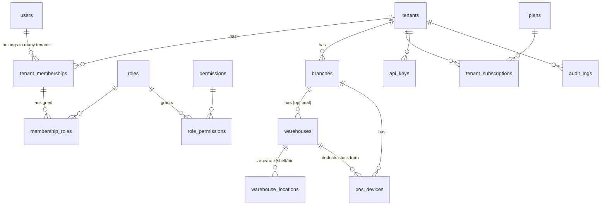
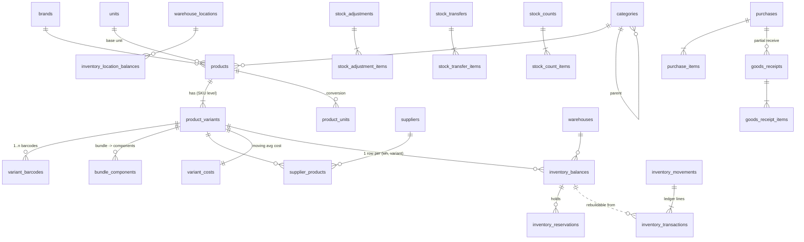
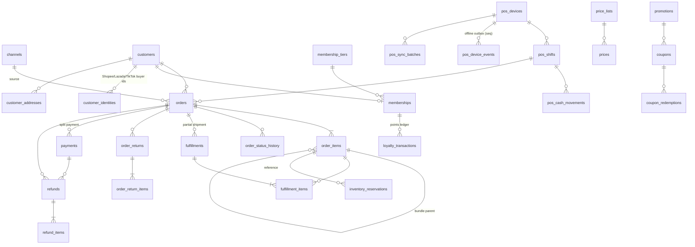
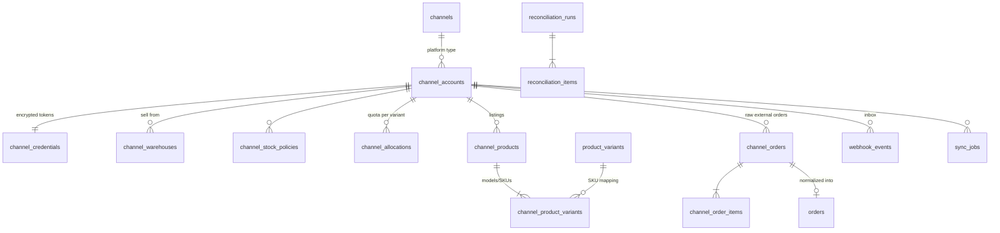

# 03 — Database (ERD, Schema, Relationships)

DDL เต็มอยู่ที่ [db/schema.sql](../db/schema.sql) — เอกสารนี้อธิบาย **ทำไม** และ **ความสัมพันธ์**

## 9. ERD

แบ่งเป็น 4 ภาพตาม domain (ERD เดียวใหญ่เกินจะอ่านได้) — ทุก FK ภายใน tenant เป็น composite `(tenant_id, x_id)` แต่ในภาพละ `tenant_id` เพื่อความกระชับ

### 9.1 Tenant / IAM / Organization


### 9.2 Catalog / Inventory


### 9.3 Orders / Payments / Customers / POS


### 9.4 Channels / Integration Infra


## 10. Schema — Relationship ของทุก Table

| Table | บทบาท | ความสัมพันธ์ / หมายเหตุ |
|---|---|---|
| `plans` | แพ็กเกจ SaaS (global) | 1–N `tenant_subscriptions` |
| `tenants` | บริษัท/ร้าน = หน่วย isolation | parent ของทุก table ที่มี `tenant_id`; `db_cluster` ใช้ route ไป shard |
| `tenant_subscriptions` | แผนที่ tenant ใช้ | N–1 tenant, N–1 plan |
| `usage_counters` | metering ต่อรอบบิล | PK (tenant, metric, period) — increment แบบ atomic |
| `users` | identity global | 1 user อยู่ได้หลาย tenant ผ่าน `tenant_memberships` |
| `user_sessions` | refresh token | N–1 user; `family_id` สำหรับ reuse detection |
| `permissions` | catalog สิทธิ์ (global, seed จาก code) | N–N roles ผ่าน `role_permissions` |
| `roles` | system + custom role ต่อ tenant | 1–N `role_permissions`, 1–N `membership_roles` |
| `role_permissions` | role ↔ permission + constraints (limit) | |
| `tenant_memberships` | user ใน tenant (+ POS PIN) | N–1 tenant, N–1 user; unique owner ต่อ tenant |
| `membership_roles` | assign role + scope (TENANT/BRANCH/WAREHOUSE) | |
| `api_keys` | key สำหรับ integration ภายนอก | hash เท่านั้น |
| `branches` | สาขา | 1–N warehouses, pos_devices, orders |
| `warehouses` | คลัง (STORE/CENTRAL/ONLINE/MARKETPLACE_FULFILLMENT/TRANSIT) | 1–N balances, locations; N–1 branch (optional) |
| `warehouse_locations` | Zone/Rack/Shelf/Bin (tree) | self-reference parent |
| `pos_devices` | เครื่อง POS | N–1 branch, N–1 warehouse (ตัด stock ที่ไหน) |
| `document_sequences` | เลขเอกสาร gap-free | lock row ต่อ (doc_type, scope, period) |
| `brands`, `categories`, `units` | master | categories เป็น tree (materialized path) |
| `products` | product family | 1–N variants; N–1 brand/category/unit |
| `product_variants` | **SKU (หน่วยที่มี stock)** | 1–N barcodes, balances, prices, channel mappings, order_items |
| `variant_barcodes` | barcode → variant (+unit) | PK (tenant, barcode) → scan ได้ผลเดียว |
| `product_units` | conversion (1 BOX = 12 PCS) | ledger เก็บเป็น base unit เสมอ |
| `bundle_components` | bundle → component variants | stock bundle = min(component.available / qty) |
| `product_images` | รูป | S3 key |
| `suppliers`, `supplier_products` | ผู้ขาย + ราคา/lead time ต่อ SKU | |
| `inventory_balances` | **current state** ต่อ (wh, variant) | ถูก lock/update ในทุก stock operation |
| `inventory_location_balances` | on_hand ระดับ bin | ผลรวม = balance.on_hand |
| `inventory_movements` | header ของ business operation + **idempotency key** | 1–N `inventory_transactions` |
| `inventory_transactions` | **ledger (source of truth)** append-only, partitioned | อ้าง movement, reference (order/PO/transfer/...) |
| `inventory_reservations` | hold ระดับ order line | FK ไป balance; unique ต่อ reference line |
| `variant_costs` | moving weighted average cost | update ตอนรับของ |
| `stock_adjustments(+_items)` | ปรับยอด + approval | post → ledger ADJUSTMENT/DAMAGE/LOSS/FOUND |
| `stock_transfers(+_items)` | โอนคลัง (partial) | ship → TRANSFER_OUT + INCOMING ปลายทาง; receive → TRANSFER_IN |
| `stock_counts(+_items)` | ตรวจนับ | approve → สร้าง adjustment (COUNT_VARIANCE) |
| `customers` (+addresses, identities) | CRM | merge ด้วย `merged_into_id`; identities map buyer id ของแต่ละ channel |
| `membership_tiers`, `memberships`, `loyalty_transactions` | loyalty | points เป็น ledger เหมือน stock |
| `price_lists`, `prices` | ราคาต่อ list/channel + scheduled + tier | |
| `promotions`, `coupons`, `coupon_redemptions` | promotion engine | |
| `channels` | platform catalog (global) | |
| `channel_accounts` | shop ที่เชื่อม | 1–1 credentials; unique shop ข้ามทั้งระบบ |
| `channel_credentials` | token เข้ารหัส | |
| `channel_warehouses` | channel ขายจากคลังไหน | |
| `channel_stock_policies` | GLOBAL_POOL/CHANNEL_ALLOCATION + safety stock | resolve: (account,variant) > (account,*) > (*,*) |
| `channel_allocations` | โควต้าต่อ channel | |
| `channel_products`, `channel_product_variants` | listing + **SKU mapping** | variant_id null = unmapped |
| `orders`, `order_items` | **Normalized internal order** | unique (account, channel_order_id) + (device, client_txn_id) |
| `order_status_history` | ประวัติ state | |
| `fulfillments(+_items)` | package / partial shipment | |
| `order_returns(+_items)` | คืนสินค้า + QC | |
| `channel_orders(+_items)` | raw external snapshot + `external_update_time` | 1–1 order |
| `payments`, `refunds`, `refund_items` | เงินเข้า/ออก | idempotency_key unique |
| `pos_shifts`, `pos_cash_movements` | กะ/ลิ้นชัก | id สร้างฝั่ง client |
| `pos_device_events`, `pos_sync_batches` | offline sync inbox | PK (device, seq) |
| `purchases`, `purchase_items`, `goods_receipts(+_items)` | PO + partial receive | |
| `webhook_events` | webhook inbox | unique (channel, dedup_key) |
| `sync_jobs` | งาน sync (มองเห็นใน UI) | dedup_key กันงานซ้ำ |
| `reconciliation_runs(+_items)` | ผลตรวจ mismatch | |
| `outbox_events` | transactional outbox | |
| `processed_events` | consumer dedup | |
| `idempotency_keys` | HTTP idempotency | |
| `audit_logs` | audit (partitioned, immutable) | |
| `notification_rules`, `notifications` | alert | |

## Multi-tenancy design ใน DB

1. **PK = (tenant_id, id)** ทุก tenant table → FK ต้องมี tenant_id → *ไม่มีทาง* ที่ order ของ tenant A จะชี้ไป variant ของ tenant B แม้ bug ใน app
2. **RLS FORCE** ทุก table; app ใช้ role `stockos_app` (NOBYPASSRLS) และตั้ง `SET LOCAL app.tenant_id` ใน tx
3. ถ้าลืมตั้ง tenant → `current_tenant_id()` = NULL → ไม่เห็นข้อมูล (fail closed) แทนที่จะเห็นทั้งหมด
4. Cross-tenant job (reconcile ทั้งระบบ, platform admin) ใช้ `stockos_platform` role แยก connection pool + audit ทุก query
5. Index ทุกตัวขึ้นต้นด้วย `tenant_id` → query plan ดี + พร้อม Citus distribution key

## Index Strategy (หลักการ)
- ทุก index เริ่มด้วย `tenant_id`
- Partial index สำหรับ "งานค้าง": `WHERE status IN ('RECEIVED','FAILED')`, `WHERE published_at IS NULL`, `WHERE status='RESERVED'`
- `pg_trgm` GIN สำหรับค้นชื่อสินค้า/ลูกค้า (ภาษาไทยไม่มี word boundary → trigram เหมาะกว่า FTS tokenizer ปกติ)
- Unique partial index = กลไก idempotency หลัก (orders_channel_uq, orders_pos_client_uq, webhook dedup)
- ตรวจ index ที่ไม่ถูกใช้ด้วย `pg_stat_user_indexes` ทุก quarter

## Partitioning
| Table | Strategy | Retention |
|---|---|---|
| `inventory_transactions` | RANGE(created_at) รายเดือน, pg_partman | เก็บถาวร (ข้อมูลบัญชี ≥ 5 ปีตามกฎหมาย) — partition เก่าย้ายไป tablespace ถูก/ export Parquet ไป S3 |
| `audit_logs` | RANGE(created_at) รายเดือน | 2 ปี online, ที่เหลือ S3 Glacier |
| `webhook_events` | ไม่ partition (ต้อง unique ทั้งตาราง) → job ย้าย PROCESSED > 30 วันไป S3 แล้วลบ | 30 วัน online |
| `outbox_events` | ลบแถว published > 7 วัน (หรือ partition รายวัน + drop) | 7 วัน |
| `orders`/`order_items` | ยังไม่ partition จนกว่า > 200M แถว; จากนั้น HASH(tenant_id) หรือ Citus | — |

## JSONB ใช้เมื่อ
- raw payload จาก platform (`webhook_events.payload`, `channel_orders.payload`) — schema ไม่คงที่
- attribute ยืดหยุ่น (`products.attributes`, `options`), settings, promotion conditions/reward
- **ไม่ใช้** กับข้อมูลที่ต้อง join/aggregate/constraint (จำนวน เงิน สถานะ)

## 37. Inventory Database Design — Balances vs Ledger

| | `inventory_balances` | `inventory_transactions` (ledger) |
|---|---|---|
| บทบาท | Current state (materialized) | Source of truth (append-only) |
| ใช้ query | "ตอนนี้มีเท่าไร", POS lookup, channel push, reserve check | "ทำไมถึงเหลือเท่านี้", stock movement report, ย้อนดู ณ วันที่, COGS, audit |
| ขนาด | #warehouses × #variants (หลักแสน–ล้าน) | โตตลอด (หลายร้อยล้าน) |
| Write | UPDATE แถวเดียว (row lock) | INSERT อย่างเดียว |
| ความถูกต้อง | derive ได้จาก ledger | canonical |

**กฎ**: ทุกการเปลี่ยน balance ต้องเกิด **ใน transaction เดียวกับ** ledger insert — ถ้าอันใดอันหนึ่ง fail ทั้งคู่ rollback → invariant:
```
balance.on_hand   = Σ ledger.quantity WHERE bucket='ON_HAND'
balance.reserved  = Σ ledger.quantity WHERE bucket='RESERVED'
... (ทุก bucket, ต่อ warehouse+variant)
```

**Query patterns**
```sql
-- Stock ปัจจุบันของ SKU ทุกคลัง (POS/Back-office)  → balances
SELECT warehouse_id, on_hand, reserved, committed, available
FROM inventory_balances WHERE tenant_id = $1 AND variant_id = $2;

-- Stock ณ วันที่ (point-in-time)  → balance ปัจจุบัน − movement หลังจากวันนั้น
SELECT b.on_hand - COALESCE(SUM(t.quantity), 0) AS on_hand_at
FROM inventory_balances b
LEFT JOIN inventory_transactions t
  ON t.tenant_id = b.tenant_id AND t.warehouse_id = b.warehouse_id AND t.variant_id = b.variant_id
 AND t.bucket = 'ON_HAND' AND t.created_at > $3
WHERE b.tenant_id = $1 AND b.variant_id = $2 AND b.warehouse_id = $4
GROUP BY b.on_hand;
-- (สำหรับ report รายวันจำนวนมาก ใช้ daily snapshot table `inventory_daily_snapshots` ที่ job สร้างทุกเที่ยงคืน)

-- Stock card (movement ของ SKU)  → ledger
SELECT created_at, transaction_type, quantity, before_quantity, after_quantity,
       reference_type, reference_id, channel_code, user_id
FROM inventory_transactions
WHERE tenant_id = $1 AND variant_id = $2 AND warehouse_id = $3 AND bucket = 'ON_HAND'
  AND created_at BETWEEN $4 AND $5
ORDER BY created_at, id;
```

**Reconciliation (ledger ↔ balance)** — job ทุกคืน + on-demand:
```sql
WITH ledger AS (
  SELECT warehouse_id, variant_id,
         SUM(quantity) FILTER (WHERE bucket='ON_HAND')   AS on_hand,
         SUM(quantity) FILTER (WHERE bucket='RESERVED')  AS reserved,
         SUM(quantity) FILTER (WHERE bucket='COMMITTED') AS committed,
         SUM(quantity) FILTER (WHERE bucket='DAMAGED')   AS damaged,
         SUM(quantity) FILTER (WHERE bucket='INCOMING')  AS incoming
  FROM inventory_transactions WHERE tenant_id = $1
  GROUP BY 1, 2)
SELECT b.warehouse_id, b.variant_id, b.on_hand, l.on_hand AS ledger_on_hand, b.reserved, l.reserved AS ledger_reserved
FROM inventory_balances b
LEFT JOIN ledger l USING (warehouse_id, variant_id)
WHERE b.tenant_id = $1
  AND (b.on_hand   IS DISTINCT FROM COALESCE(l.on_hand, 0)
    OR b.reserved  IS DISTINCT FROM COALESCE(l.reserved, 0)
    OR b.committed IS DISTINCT FROM COALESCE(l.committed, 0)
    OR b.damaged   IS DISTINCT FROM COALESCE(l.damaged, 0)
    OR b.incoming  IS DISTINCT FROM COALESCE(l.incoming, 0));
```
เมื่อ ledger ใหญ่มาก: ใช้ **checkpoint** — ตาราง `inventory_checkpoints(tenant, wh, variant, as_of_tx_created_at, on_hand, reserved, ...)` สร้างรายเดือน แล้ว reconcile = checkpoint + Σ ledger หลัง checkpoint

ผลลัพธ์ mismatch → **ไม่แก้อัตโนมัติ** → alert CRITICAL + สร้าง `reconciliation_items` → ผู้ดูแลกด rebuild (ดู [13-dr-and-operations.md](13-dr-and-operations.md)) ซึ่งจะเขียน `REBUILD_CORRECTION` ใน ledger? **ไม่** — mismatch ระหว่าง ledger↔balance หมายถึง balance ผิด (ledger คือความจริง) → rebuild balance จาก ledger โดยตรงภายใต้ lock + audit log
