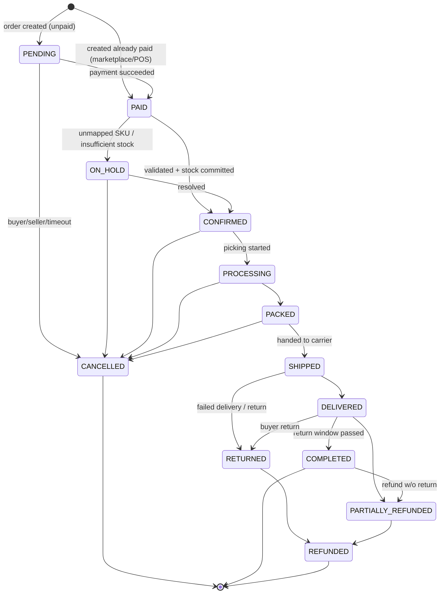
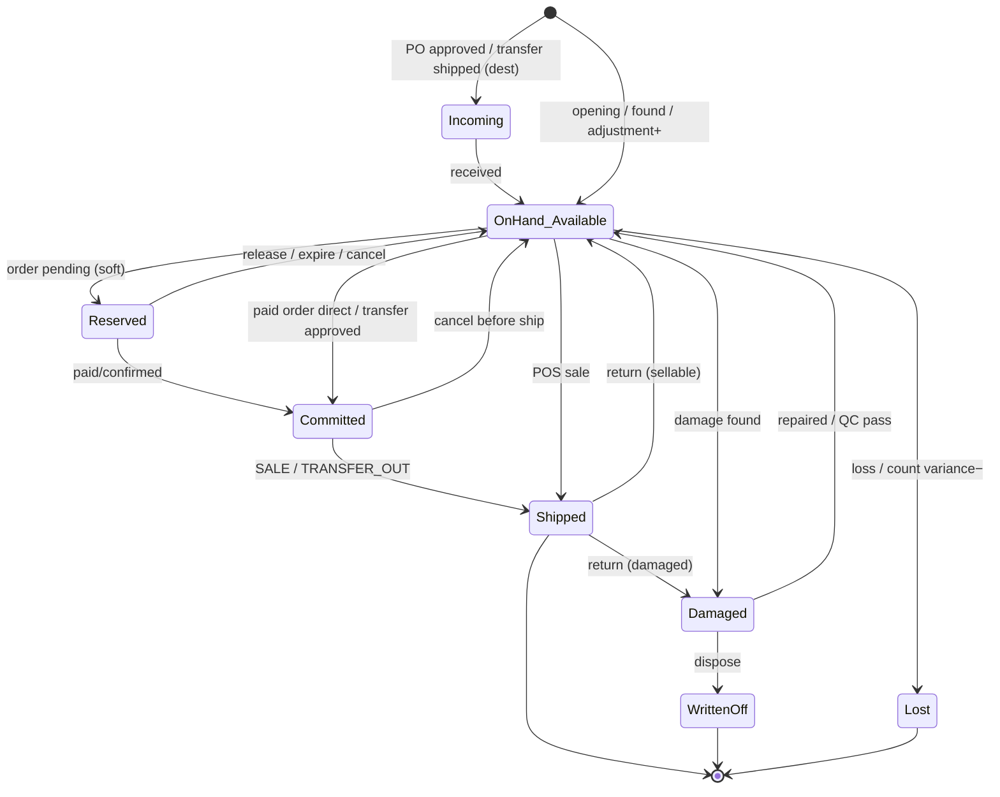

# 04 — Inventory Core ★ (Ledger, Reservation, Concurrency, State Machines, Allocation)

> ส่วนที่สำคัญที่สุดของระบบ ทุกคนในทีมต้องอ่านไฟล์นี้ก่อนเขียนโค้ดที่แตะ stock

## 1. Stock Buckets

ต่อ (tenant, warehouse, variant) มี 1 แถวใน `inventory_balances`:

| Bucket | ความหมาย | นับรวมใน on_hand? |
|---|---|---|
| **on_hand** | ของจริงสภาพดีที่อยู่ในคลัง | — |
| **reserved** | ถูกจองแบบ soft (order ยังไม่จ่าย/ยังไม่ยืนยัน, มี TTL) | เป็น subset ของ on_hand |
| **committed** | ถูกจองแบบ hard (order ยืนยัน/จ่ายแล้ว รอส่ง, transfer อนุมัติแล้ว) | เป็น subset ของ on_hand |
| **available** | `on_hand − reserved − committed` (generated column) | — |
| **damaged** | ของเสีย/รอ QC (แยกจาก on_hand, ขายไม่ได้) | ไม่ |
| **incoming** | PO อนุมัติแล้ว/transfer กำลังมา ยังไม่รับเข้า | ไม่ |

ตัวอย่าง: On Hand 100, Reserved 20 → Available 80. Shopee order 10 เข้ามา → Reserved 30, Available 70. เมื่อ order จ่ายแล้ว → Reserved 20, Committed 10. เมื่อส่งของ → On Hand 90, Committed 0.

**Sellable to channel** (ค่าที่ push ไป marketplace) = f(available, policy) — ดู §8

## 2. Ledger Design (§11)

### โครงสร้าง
- **`inventory_movements`** = 1 business operation (เช่น "reserve order SO-123") → ถือ `idempotency_key` UNIQUE
- **`inventory_transactions`** = 1 แถวต่อการเปลี่ยน **1 bucket** ของ **1 (warehouse, variant)** เก็บ `quantity` (signed delta), `before_quantity`, `after_quantity`, `transaction_type`, `reference_type/id`, `channel_code`, `user_id`, `device_id`, `occurred_at`, `created_at`, `request_id`

ทำไมแยกแถวต่อ bucket: operation เดียวอาจแตะหลาย bucket (เช่น SHIP: on_hand −2 และ committed −2) → การ rebuild = `SUM(quantity) GROUP BY bucket` ตรงไปตรงมา และ `before/after` ของแต่ละ bucket ตรวจสอบได้ในตัว (`CHECK after = before + quantity`)

**ลำดับของ ledger**: ทุกแถวเก็บ `balance_version` (= `inventory_balances.version` หลังการเปลี่ยน) — ใช้เรียง stock card และตรวจ chain `before = previous after` ต่อ (warehouse, variant, bucket). **ห้ามเรียงด้วย `created_at`** เพราะ `now()` คือเวลาเริ่ม transaction ไม่ใช่ลำดับที่ได้ lock/commit (tx ที่เริ่มก่อนอาจ commit ทีหลัง)

### Effect matrix (ทุก operation ที่อนุญาต — โค้ดต้องใช้ตารางนี้เป็น single source)

| Operation (transaction_type) | ON_HAND | RESERVED | COMMITTED | DAMAGED | INCOMING | เกิดเมื่อ |
|---|---|---|---|---|---|---|
| RESERVATION | | +q | | | | order เข้า (unpaid/pending) |
| RELEASE | | −q | | | | cancel ก่อน paid / reservation expire |
| COMMIT | | −q | +q | | | order paid/confirmed (มี reservation อยู่) |
| COMMIT (direct) | | | +q | | | order เข้ามาแบบ paid แล้ว (ข้าม reserve) |
| CANCEL (uncommit) | | | −q | | | cancel หลัง confirm แต่ก่อนส่ง |
| SALE (from committed) | −q | | −q | | | order SHIPPED (marketplace/web) |
| SALE (direct) | −q | | | | | POS ชำระเงินเสร็จ |
| RETURN (sellable) | +q | | | | | รับคืน QC ผ่าน |
| RETURN (damaged) | | | | +q | | รับคืน QC ไม่ผ่าน |
| INCOMING | | | | | +q | PO approved |
| INCOMING_CANCEL | | | | | −q | PO line cancelled/closed |
| PURCHASE_RECEIPT | +q | | | | −q* | รับของ (*ถ้ามาจาก PO) |
| TRANSFER_OUT | −q | | −q | | | transfer shipped (ต้นทาง, มี commit อยู่จากตอน approve) |
| TRANSFER_IN | +q | | | | −q | transfer received (ปลายทาง) |
| DAMAGE | −q | | | +q | | พบของเสียในคลัง |
| LOSS | −q | | | | | ของหาย |
| FOUND | +q | | | | | เจอของ |
| COUNT_VARIANCE | ±q | | | | | stock count approved |
| ADJUSTMENT | ±q | | | ±q | | manual adjust (approved) |

**ห้าม** มี code path อื่นเขียน `inventory_balances` — มีแค่ `InventoryEngine.apply()` ที่รับ `MovementCommand` แล้ว map ผ่าน effect matrix นี้ (lint rule: ห้าม string `inventory_balances` นอก `modules/inventory/infrastructure`)

## 3. Concurrency — ป้องกัน Overselling (§7)

### 3.1 ทำไม `UPDATE products SET stock = stock - 1` ไม่พอ
- ไม่มีเงื่อนไข → ติดลบได้
- ไม่มี ledger → ไม่รู้ว่าทำไม
- ไม่มี idempotency → webhook มา 2 ครั้งตัด 2 ครั้ง
- Read-then-write ในแอป (`SELECT stock` → คำนวณ → `UPDATE`) → lost update ภายใต้ concurrency

### 3.2 กลไกหลัก: Conditional Atomic Update (row lock โดยปริยาย)

```sql
UPDATE inventory_balances
   SET reserved   = reserved + $qty,
       version    = version + 1,
       updated_at = now()
 WHERE tenant_id = $tenant AND warehouse_id = $wh AND variant_id = $variant
   AND on_hand - reserved - committed - $min_remaining >= $qty      -- ★ เงื่อนไขอยู่ใน statement เดียว
RETURNING reserved - $qty AS before_reserved, reserved AS after_reserved, available, version;
```

**ทำไมปลอดภัยใน READ COMMITTED**: เมื่อ 2 transaction UPDATE แถวเดียวกันพร้อมกัน tx ที่ 2 จะ **รอ row lock** เมื่อ tx แรก commit แล้ว Postgres จะ **re-evaluate WHERE กับ version ใหม่ของแถว** (EvalPlanQual) → ถ้า available ไม่พอแล้ว จะได้ 0 rows → เรารู้ทันทีว่า "ไม่พอ" โดยไม่ต้อง SERIALIZABLE และไม่มี lost update

ตัวอย่าง Stock = 1, Shopee และ POS มาพร้อมกัน:
```mermaid
sequenceDiagram
    participant S as Shopee order worker (Tx A)
    participant P as POS sale API (Tx B)
    participant DB as Postgres row (wh1, SKU-001) available=1
    S->>DB: UPDATE ... SET reserved+1 WHERE available>=1
    Note over DB: Tx A ได้ row lock, available→0
    P->>DB: UPDATE ... SET on_hand-1 WHERE available>=1
    Note over P,DB: Tx B รอ lock
    S->>DB: INSERT ledger, reservation, outbox; COMMIT
    Note over DB: release lock
    DB-->>P: re-check WHERE: available=0 → 0 rows
    P-->>P: InsufficientStock → rollback (แจ้งแคชเชียร์)
```

### 3.3 เทคนิคแต่ละตัว — ใช้ตรงไหน

| เทคนิค | ใช้กับ | เหตุผล |
|---|---|---|
| **DB transaction** (READ COMMITTED) | ทุก stock operation: balance update + ledger + reservation + order state + outbox ใน tx เดียว | all-or-nothing |
| **Row locking (implicit via UPDATE)** | `inventory_balances` | ถูกที่สุดและถูกต้อง |
| **`SELECT ... FOR UPDATE`** | operation ที่ต้องอ่านหลายค่าก่อนตัดสิน (เช่น transfer receive, count posting, bundle) — lock ตามลำดับ | |
| **Lock ordering** | order หลาย line: sort `(warehouse_id, variant_id)` ก่อน update ทุกครั้ง | กัน deadlock |
| **Atomic conditional update** | reserve / POS sale / commit direct | กัน oversell |
| **Optimistic locking (`version`)** | product, price, promotion, PO, transfer header, channel_credentials | contention ต่ำ, ไม่ block user; HTTP `If-Match` → 409 |
| **Idempotency** | `inventory_movements.idempotency_key` UNIQUE + `INSERT ... ON CONFLICT DO NOTHING` | retry/webhook ซ้ำ/job ซ้ำ ไม่ตัดซ้ำ |
| **Reservation** | order ทุก channel ก่อนส่ง | แยก "สัญญาว่าจะขาย" ออกจาก "ของออกจริง" |
| **Distributed lock (Redis/advisory)** | **ไม่ใช้กับ stock** — ใช้กับ: token refresh ต่อ channel account, scheduler leader, "stock push ต่อ (account, variant)" coalescing | DB lock ทำหน้าที่แล้ว, เพิ่ม lock ซ้อน = failure mode เพิ่ม |
| **Queue** | งานที่ช้า/ข้ามระบบ: webhook processing, stock push, notifications | แยก latency ภายนอกออกจาก tx |
| **Retry** | deadlock `40P01`, serialization `40001`, lock timeout `55P03` → retry ทั้ง tx (max 3, jitter 10–50ms) | |
| **Dead-letter queue** | job ที่ retry ครบแล้วยังล้ม | ไม่หาย, คนแก้ได้, replay ได้ |

**Timeouts** (ตั้งต่อ tx ใน inventory): `SET LOCAL lock_timeout = '2s'; SET LOCAL statement_timeout = '5s';` → ไม่ให้ tx ค้างยาวจนคิวยาว

### 3.4 Reference Implementation (TypeScript)

```ts
// packages/core/src/modules/inventory/application/inventory-engine.ts
export class InventoryEngine {
  constructor(private readonly db: Database, private readonly outbox: Outbox, private readonly clock: Clock) {}

  /**
   * Apply one business movement atomically. Idempotent by cmd.idempotencyKey.
   * MUST be called inside a tenant-scoped transaction (tx has SET LOCAL app.tenant_id).
   */
  async apply(tx: Tx, cmd: MovementCommand): Promise<MovementResult> {
    await tx.execute(sql`SET LOCAL lock_timeout = '2s'`);

    // 1) Idempotency gate — first writer wins; replay returns the original result.
    const inserted = await tx.execute(sql`
      INSERT INTO inventory_movements (tenant_id, id, idempotency_key, movement_type, reference_type,
                                       reference_id, channel_code, user_id, request_id)
      VALUES (${cmd.tenantId}, ${cmd.movementId}, ${cmd.idempotencyKey}, ${cmd.type}, ${cmd.referenceType},
              ${cmd.referenceId}, ${cmd.channelCode}, ${cmd.userId}, ${cmd.requestId})
      ON CONFLICT (tenant_id, idempotency_key) DO NOTHING
      RETURNING id`);
    if (inserted.rows.length === 0) {
      return this.loadExistingResult(tx, cmd.tenantId, cmd.idempotencyKey); // replay
    }

    // 2) Deterministic lock order prevents deadlocks between multi-line orders.
    const lines = [...cmd.lines].sort(compareBy(l => `${l.warehouseId}:${l.variantId}`));

    const results: LineResult[] = [];
    for (const line of lines) {
      const effects = EFFECT_MATRIX[cmd.type](line);          // e.g. { RESERVED: +q }
      const guard = GUARDS[cmd.type];                          // e.g. 'available >= q' | 'committed >= q' | null
      const row = await this.updateBalance(tx, cmd.tenantId, line, effects, guard);
      if (!row) {
        throw new InsufficientStockError(line.variantId, line.warehouseId, line.quantity); // rolls back everything
      }
      await this.insertLedgerLines(tx, cmd, line, effects, row);  // one row per touched bucket, with before/after
      results.push(row);
    }

    // 3) Domain event in the SAME transaction (transactional outbox).
    await this.outbox.add(tx, {
      type: 'StockChanged',
      aggregateType: 'InventoryBalance',
      tenantId: cmd.tenantId,
      payload: { movementId: cmd.movementId, cause: cmd.type,
                 items: results.map(r => ({ warehouseId: r.warehouseId, variantId: r.variantId,
                                             available: r.available, version: r.version })) },
    });
    return { movementId: cmd.movementId, lines: results, replayed: false };
  }

  private async updateBalance(tx: Tx, tenantId: string, line: MovementLine, e: BucketDelta, guard: Guard | null) {
    // Built from a whitelist of bucket names only — never from user input.
    const r = await tx.execute(sql`
      UPDATE inventory_balances
         SET on_hand   = on_hand   + ${e.ON_HAND ?? 0},
             reserved  = reserved  + ${e.RESERVED ?? 0},
             committed = committed + ${e.COMMITTED ?? 0},
             damaged   = damaged   + ${e.DAMAGED ?? 0},
             incoming  = incoming  + ${e.INCOMING ?? 0},
             version   = version + 1,
             updated_at = now()
       WHERE tenant_id = ${tenantId} AND warehouse_id = ${line.warehouseId} AND variant_id = ${line.variantId}
         AND ${guardSql(guard, line)}
      RETURNING warehouse_id, variant_id, on_hand, reserved, committed, damaged, incoming, available, version`);
    return r.rows[0] ?? null;  // before = after - delta (computed in insertLedgerLines)
  }
}

// Guards (ทุกตัวเป็น SQL fragment คงที่ + parameter)
//  RESERVATION / SALE(direct) / COMMIT(direct): on_hand - reserved - committed - min_remaining >= q
//                                               OR (negative_allowed AND line.allowNegative)   ← POS offline เท่านั้น
//  COMMIT:   reserved >= q        RELEASE: reserved >= q        CANCEL: committed >= q
//  SALE(from committed) / TRANSFER_OUT: committed >= q AND on_hand >= q
//  LOSS / DAMAGE / COUNT_VARIANCE(-): on_hand >= q  (หรือ negative_allowed)
```

**Balance row ยังไม่มี** → สร้างด้วย `INSERT ... ON CONFLICT DO NOTHING` ตอน variant ถูก assign เข้าคลัง / ตอนรับของครั้งแรก (reserve บนแถวที่ไม่มี = insufficient)

**Transaction wrapper** (ทุก use case):
```ts
await db.tenantTx(tenantId, async (tx) => {            // BEGIN; SET LOCAL app.tenant_id=...; SET LOCAL statement_timeout='5s'
  const order = await orders.lockForUpdate(tx, orderId); // SELECT ... FOR UPDATE (order row ก่อนเสมอ → lock order: order → balances)
  await inventory.apply(tx, reserveCmd(order));
  await orders.transition(tx, order, 'CONFIRMED');
}, { retryOn: ['40P01', '40001', '55P03'], maxRetries: 3 });
```
**Global lock order**: `orders` row → `inventory_balances` (sorted) → `channel_allocations` → อื่น ๆ — ห้ามกลับลำดับ

### 3.5 Marketplace ≠ POS: "กันขายเกิน" มีความหมายต่างกัน
- **POS / Website / API**: เรายังไม่รับเงิน → ถ้า reserve ไม่ผ่าน = **ปฏิเสธการขาย** (POS แสดง "สต็อกไม่พอ", manager override ได้ถ้า warehouse `allow_negative_stock`)
- **Marketplace**: order **เกิดขึ้นแล้ว** บน platform (ลูกค้าจ่ายแล้ว) เราปฏิเสธไม่ได้ → ถ้า reserve ไม่ผ่าน: order → `ON_HOLD` + `inventory_status = BACKORDER` + alert **OVERSOLD** (CRITICAL) → คนตัดสินใจ: หาของจากคลังอื่น / รอ PO / ยกเลิก (เสีย penalty) — ระบบ **ห้าม** ทำให้ balance ติดลบเงียบ ๆ
- ดังนั้นการป้องกัน oversell บน marketplace = **push stock ให้เร็วและระมัดระวัง** (safety stock + buffer + push ทันทีเมื่อ available เปลี่ยน) → §8

## 4. Stock Reservation Design (§12)

| Type | เมื่อไร | TTL | Bucket |
|---|---|---|---|
| **Soft** | order สร้างแต่ยังไม่จ่าย (Shopee `UNPAID`, website checkout pending, POS hold order ที่เลือก "จองของ") | ตั้งได้: website 15–30 นาที; marketplace UNPAID = ตามนโยบาย platform (auto-cancel) → เราไม่ expire เอง แต่รอ webhook CANCELLED + safety net 72 ชม. | RESERVED |
| **Hard** | order paid/confirmed, transfer approved | ไม่มี TTL | COMMITTED |

- 1 reservation ต่อ `(order_item, warehouse, variant)` → unique constraint → idempotent โดยธรรมชาติ
- **Partial**: `fulfilled_qty`, `released_qty` ใน reservation รองรับ partial ship / partial cancel
- **Expiry job** (ทุก 1 นาที):
  ```sql
  SELECT tenant_id, id FROM inventory_reservations
  WHERE status = 'RESERVED' AND expires_at < now()
  ORDER BY expires_at LIMIT 500 FOR UPDATE SKIP LOCKED;
  ```
  → แต่ละตัว apply `RELEASE` ด้วย idempotency key `resv:{id}:expire` + ส่ง event `InventoryReleased`
- **Bundle**: order line ของ bundle → สร้าง reservation ของ **component** แต่ละตัว (qty × component.quantity) ใน movement เดียว; bundle ไม่มี balance ของตัวเอง
- **Multi-warehouse**: เลือกคลังด้วย `FulfillmentRouter` — (1) `channel_accounts.default_warehouse_id` (2) คลังใน `channel_warehouses` ตาม priority ที่ available พอ **ทั้ง order** (ไม่ split) (3) ถ้าไม่มีคลังเดียวพอ → split ตาม priority (config `allow_split_fulfillment`) หรือ BACKORDER

## 5. Order State Machine (§13, §16)



POS sale: `DRAFT (cart) → PAID → COMPLETED` ใน tx เดียว (fulfilled at counter)

### ผลต่อ Inventory ของแต่ละ transition

| Transition | Inventory effect | Idempotency key |
|---|---|---|
| → PENDING | RESERVATION (soft) ต่อ line | `order:{id}:reserve` |
| PENDING → PAID/CONFIRMED | COMMIT (reserved → committed) | `order:{id}:commit` |
| [*] → PAID (มาแบบจ่ายแล้ว) | COMMIT(direct) | `order:{id}:commit` |
| PENDING → CANCELLED | RELEASE | `order:{id}:release` |
| CONFIRMED/PROCESSING/PACKED → CANCELLED | CANCEL (committed −q) | `order:{id}:cancel` |
| → PROCESSING / PACKED | ไม่เปลี่ยน bucket (ถ้าใช้ bin: ย้าย location → packing area) | — |
| → SHIPPED (ทั้ง order หรือ fulfillment) | SALE: on_hand −q, committed −q ต่อ fulfillment item + บันทึก COGS (`unit_cost`) | `fulfillment:{id}:ship` |
| POS PAID → COMPLETED | SALE(direct) on_hand −q | `pos:{device}:{client_txn_id}:sale` |
| → RETURNED (ของถึงคลัง + QC) | RETURN → ON_HAND (sellable) หรือ DAMAGED | `return:{id}:item:{line}:restock` |
| → REFUNDED / PARTIALLY_REFUNDED | **ไม่แตะ stock** (เงินเท่านั้น) เว้นแต่มี return ที่รับของแล้ว | — |
| deduct_on = CONFIRMED (tenant setting) | SALE ตอน CONFIRMED แทน SHIPPED (ร้านเล็กที่ไม่แยก pack/ship) | |

**กฎ state machine**:
- Transition table อยู่ใน `orders/domain/order-state-machine.ts` (pure function `transition(order, event) → {nextState, effects[]}`) — unit-test ครบทุกคู่
- Transition ที่ไม่ถูกต้อง → `InvalidTransitionError` (ไม่เงียบ) ยกเว้นมาจาก channel ที่ out-of-order → ดู [06](06-channel-integrations.md)
- ทุก transition เขียน `order_status_history` + outbox event ใน tx เดียว

## 6. Inventory State Machine (§14) — มุมมองต่อ "หน่วยสินค้า"



## 7. Real Flows

### 7.1 Shopee order → stock (happy path)
```mermaid
sequenceDiagram
    autonumber
    participant SP as Shopee
    participant WG as webhook-gateway
    participant DB as Postgres
    participant Q as Queue
    participant W as worker (order-ingest)
    participant AD as ShopeeAdapter
    participant INV as InventoryEngine
    participant SY as worker (stock-sync)

    SP->>WG: POST /webhooks/shopee (order status push)
    WG->>WG: verify HMAC signature
    WG->>DB: INSERT webhook_events ON CONFLICT(dedup_key) DO NOTHING
    WG-->>SP: 200 OK (<300ms)
    DB-->>Q: outbox relay / webhook dispatcher enqueue {webhook_event_id}
    Q->>W: process
    W->>AD: getOrder(order_sn)  ← ดึง detail ล่าสุดจาก API เสมอ (ไม่เชื่อ body)
    AD-->>W: NormalizedOrder (+ update_time)
    W->>DB: BEGIN; upsert channel_orders (skip ถ้า update_time เก่ากว่า)
    W->>DB: map SKU via channel_product_variants
    alt SKU unmapped
        W->>DB: order ON_HOLD (UNMAPPED_SKU) + alert
    else mapped
        W->>DB: upsert orders (unique account+order_sn) FOR UPDATE
        W->>INV: apply(RESERVATION or COMMIT) — conditional update + ledger
        INV->>DB: outbox StockChanged
    end
    W->>DB: COMMIT; mark webhook PROCESSED
    DB-->>Q: StockChanged → ChannelSyncRequested (ทุก channel ที่ map variant นี้, ยกเว้นต้นทางถ้าไม่จำเป็น)
    Q->>SY: push stock (debounced 2s, coalesced per account+variant)
    SY->>DB: compute sellable qty (policy)
    SY->>AD: updateInventory(...)
```

### 7.2 POS online sale
`scan → cart (local) → pay → POST /pos/sales (Idempotency-Key = client_txn_id)` → tx: create order PAID/COMPLETED + payment + SALE(direct) with guard → 201 → print receipt. Insufficient → 409 `STOCK_INSUFFICIENT` → UI แจ้ง + ปุ่ม "Manager override" (ถ้าคลังอนุญาต negative)

### 7.3 Offline POS → ดู [05-pos.md](05-pos.md)

## 8. Channel Stock Allocation (§12 ของ requirement)

### Policy resolution
`channel_stock_policies` เลือกแถวที่เฉพาะที่สุด: (account, variant) → (account, *) → (*, variant) → (*, *) → default GLOBAL_POOL, safety 0

### GLOBAL_POOL (default)
```
pool_available = Σ available ของทุก warehouse ใน channel_warehouses(account)
sellable       = floor( max(0, pool_available − safety_stock) × (1 − buffer_percent/100) )
if sellable <= push_zero_below → 0
if max_push_qty → min(sellable, max_push_qty)
pushed_qty     = floor(sellable / quantity_multiplier)          -- listing "แพ็ค 3"
bundle         = min over components( floor(component_sellable / component_qty) )
```
ตัวอย่าง: Actual 100, Safety 10 → push 90 ให้ทุก marketplace (ขายจาก pool เดียวกัน, ใครขายก่อนได้ก่อน)

### CHANNEL_ALLOCATION
- Admin กำหนด `channel_allocations.allocated_qty` ต่อ (account, warehouse, variant) เช่น Shopee 30, Lazada 20, TikTok 20, POS ใช้ส่วนที่เหลือ (unallocated)
- `pushed_qty(account) = min(allocated − consumed, pool_available − safety)` — ไม่เกินของจริงเสมอ
- Order จาก channel นั้น → ในtx เดียวกับ reserve: `UPDATE channel_allocations SET consumed = consumed + q WHERE ... AND allocated - consumed >= q` (lock order: balances → allocations) ถ้าโควต้าหมดแต่ pool ยังมี → config `overflow_to_pool` (true = ใช้ pool ได้, false = hold)
- Cancel/return → คืนโควต้า
- **Unallocated** = available − Σ(allocated − consumed) → POS/website ขายได้จากส่วนนี้ (guard `min_remaining` = ยอดที่ถูก allocate ไว้ให้ channel อื่น)
- Rebalance: manual หรือ auto rule (เช่น ทุกคืน: โควต้าที่ไม่ขายใน 7 วันคืน pool) — **AI แนะนำได้แต่ต้องมีคนกดยืนยัน**

### Push mechanics (กัน push storm และค่าเก่าทับค่าใหม่)
1. ทุก `StockChanged` → enqueue job `stock-push` ด้วย **jobId = `{account}|{variant}`** + delay 1–2s → BullMQ dedupe (coalescing: 50 การขายใน 2 วิ = push ครั้งเดียว)
2. Worker ตอนรัน **อ่านค่าล่าสุด** จาก DB (ไม่ใช้ค่าใน event) → compute → push
3. เก็บ `last_pushed_balance_version`; ถ้า balance version ≤ ที่ push แล้ว → skip
4. Platform ที่รองรับ batch (หลาย model ต่อ call) → รวม variant ของ item เดียวกัน
5. Flash-sale mode: ลด debounce เหลือ 0–500ms, priority สูงสุดสำหรับ SKU ที่ available < threshold (เช่น ≤ 5) — "ใกล้หมดต้อง push ก่อน"
6. Available = 0 → push 0 **ทันที** (priority 1, ไม่ debounce)

## 9. Warehouse Operations & Ledger Effects

### Purchase receive (partial) + Moving Average Cost
```
PO approved:   INCOMING +100
Receive 60:    PURCHASE_RECEIPT ON_HAND +60, INCOMING −60   (purchase_items.received_qty = 60 → PO PARTIALLY_RECEIVED)
Receive 40:    ... → RECEIVED
Close PO ค้าง: INCOMING_CANCEL −ค้าง
new_avg_cost = (old_qty × old_avg + recv_qty × recv_cost) / (old_qty + recv_qty)     -- old_qty = Σ on_hand ทุกคลังของ tenant (ถ้า ≤0 ใช้ recv_cost)
```
update `variant_costs` ด้วย `SELECT ... FOR UPDATE` ใน tx เดียวกับ receipt; SALE บันทึก `unit_cost = avg_cost` ณ ขณะนั้น → COGS

### Transfer (partial)
| Status | Source WH | Dest WH |
|---|---|---|
| REQUESTED | — | — |
| APPROVED | COMMIT(direct) approved_qty (กันถูกขาย) | — |
| PICKING | — | — |
| SHIPPED (shipped_qty ≤ approved) | TRANSFER_OUT: on_hand −shipped, committed −shipped; ส่วนที่ไม่ส่ง → CANCEL (committed −) | INCOMING +shipped |
| RECEIVED (received + damaged ≤ shipped) | — | TRANSFER_IN: on_hand +received; DAMAGED +damaged; INCOMING −(received+damaged) |
| ขาด (shipped − received − damaged > 0) | — | INCOMING −ขาด + บันทึก LOSS ที่ warehouse `TRANSIT` (สอบสวน) |
| COMPLETED | | |

### Adjustment (with approval)
- `inventory.adjust` → สร้าง DRAFT; ถ้า |Σ delta × cost| > limit ของ role หรือ |qty| > `max_qty` → `PENDING_APPROVAL` → ผู้มี `inventory.adjust.approve` (ต้องไม่ใช่คนขอ) → `POSTED` = apply ledger
- เหตุผลบังคับ: DAMAGE / LOST / FOUND / COUNT_ERROR / EXPIRED / OTHER(+note)
- ทุก step → audit log

### Stock Count
```
Create session (FULL/CYCLE/BLIND, scope) → snapshot on_hand + ledger position ต่อ item
→ Scan/Count (mobile, offline ได้; BLIND = ไม่เห็น snapshot)
→ Submit → Compare: expected = snapshot + movement_since_snapshot (ledger หลัง snapshot_tx) ← ไม่ต้องหยุดขายระหว่างนับ
→ Difference > tolerance → recount required
→ Approval → สร้าง stock_adjustment (source=COUNT) → POSTED → COUNT_VARIANCE ใน ledger
```
`freeze_mode = FREEZE` (option): lock balance ของ scope ไม่ให้ขาย (ใช้ตอนนับปีละครั้ง)

### Location (bin) inventory
- เปิดต่อ warehouse (`use_locations`); `inventory_balances` ยังเป็นระดับ warehouse (reserve/available ใช้ระดับนี้) ส่วน `inventory_location_balances` track ว่าอยู่ bin ไหน (ใช้ตอน pick/putaway/count)
- invariant: Σ location on_hand = warehouse on_hand (reconcile job)
