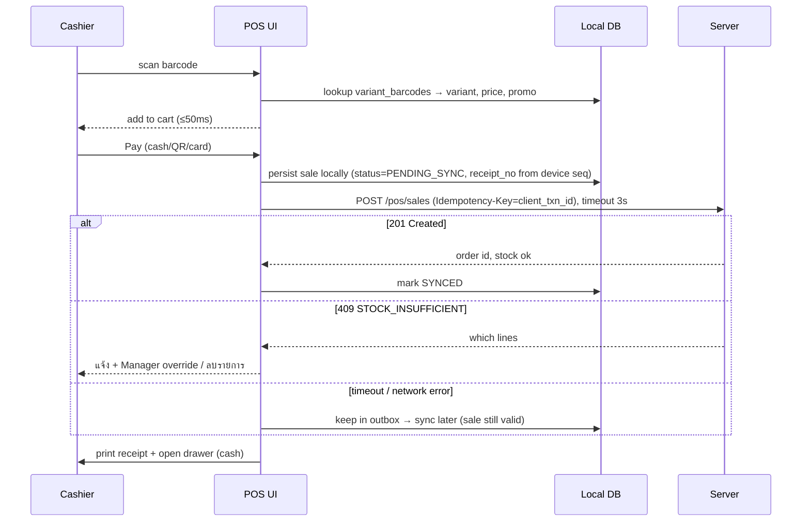

# 05 — POS (Architecture, Offline-first, Hardware)

## 15. POS Architecture

```mermaid
flowchart TB
    subgraph Device["POS Device (Windows PC / Android POS / iPad / Browser)"]
        UI[React UI<br/>scanner-first, keyboard shortcuts]
        ENG["pos-engine (shared TS)<br/>cart · pricing · promo · VAT · rounding"]
        REPO[Local Repository]
        LDB[(Local DB<br/>SQLite: native / WASM+OPFS<br/>fallback IndexedDB)]
        OB[Local Outbox<br/>events with device seq]
        SYNC[Sync Engine<br/>push / pull / heartbeat]
        HB[HardwareBridge]
        UI --> ENG --> REPO --> LDB
        REPO --> OB
        SYNC --> OB
        SYNC --> LDB
        UI --> HB
    end
    subgraph Shell["Native Shell"]
        TAURI[Tauri (Win/macOS)<br/>Rust plugins: serial, USB, TCP 9100]
        CAP[Capacitor (Android/iPad)<br/>Sunmi/iMin SDK, Star/Epson SDK]
    end
    HB --> TAURI & CAP
    HB --> PRN[Receipt printer ESC/POS]
    HB --> DRW[Cash drawer via printer kick]
    HB --> SCN[Barcode scanner HID/serial/camera]
    HB --> CDS[Customer display]
    HB --> EDC[Payment terminal EDC]
    SYNC <-->|HTTPS, device token| API[api: /pos/*]
```

**หลักการ**: POS เป็น **local-first** เสมอ — แม้ online, การ scan/คำนวณ/ค้นหาทำจาก local DB (latency < 50ms) ส่วน server ใช้สำหรับ **ยืนยัน stock + บันทึก**

### Sale flow (online)


### POS Features ↔ Implementation

| Feature | Design |
|---|---|
| Login Cashier | Device ลงทะเบียนครั้งเดียว (device token, admin approve) → cashier login ด้วย **PIN 4–6 หลัก** (hash cached offline); lock หลังผิด 5 ครั้ง |
| Open/Close shift | `pos_shifts` id สร้างที่ client; close → นับเงิน (denomination) → expected vs counted → variance → พิมพ์ Z-report |
| Cash drawer | เปิดเมื่อจ่ายเงินสด/เงินทอน; "No-sale open" ต้องมีสิทธิ์ + log `pos_cash_movements` |
| Barcode / Search | barcode index ใน local DB; ค้นชื่อไทยด้วย trigram/prefix บน local; รองรับ scan barcode ลัง (unit factor) |
| Cart / Discount / Coupon / Member | `pos-engine` คำนวณ; discount เกิน limit ของ role → Manager PIN override (audit) |
| Tax | VAT 7% inclusive (default) / exclusive; ปัดเศษระดับบิล (ตาม setting 0.25/0.50/1.00 บาท) |
| Payment | Cash (เงินทอน), Card (EDC semi-integrated หรือบันทึก approval code manual), PromptPay QR (dynamic ผ่าน gateway + webhook confirm; static EMVCo QR เมื่อ offline + cashier ยืนยันสลิป), Split payment หลาย method ต่อบิล |
| Refund / Exchange | อ้างอิงใบเสร็จเดิม (scan barcode บนใบเสร็จ) → เลือก line/qty → คืนเงินตาม method เดิม → restock (SELLABLE/DAMAGED) → ออก **ใบลดหนี้**; Exchange = refund + new sale ใน transaction เดียว (ต่างราคา = จ่ายเพิ่ม/คืน) |
| Receipt / Reprint | ใบกำกับภาษีอย่างย่อ (มีคำว่า "ใบกำกับภาษีอย่างย่อ", เลขผู้เสียภาษี, POS registration no., "VAT Included"), ใบกำกับเต็มรูปขอภายหลังได้; Reprint พิมพ์คำว่า "สำเนา" + audit |
| Hold / Resume | cart เก็บใน local DB (ไม่ reserve stock default; option "จองสินค้า" = soft reservation TTL 30 นาทีเมื่อ online) |

## 16. Offline POS Architecture (§45)

### Local data
| ข้อมูล | ทิศทาง | วิธี sync |
|---|---|---|
| Catalog (variants, barcodes, units), price lists, promotions, tax settings, users/PIN hashes | Server → Device | Delta pull ด้วย change cursor (`updated_at, id`) ทุก 60s + push notification (SSE/WebSocket) เมื่อราคาเปลี่ยน |
| Stock snapshot (available ของคลัง POS) | Server → Device | ทุก 60s + หลังทุก sale online; ใช้ **แสดง/เตือน** เท่านั้น ไม่ใช่ตัวตัดสิน |
| Customers (สาขานี้ + ที่ซื้อบ่อย) | 2 ทาง | pull subset; สร้างใหม่ offline → event |
| Sales, refunds, shifts, cash movements, new customers | Device → Server | **Local outbox** (event log) |

### Device sequence & identity
- ทุก event มี `event_id` (UUIDv7, client), `device_id`, **`seq`** (monotonic ต่อ device, เก็บใน local DB tx เดียวกับ event), `occurred_at` (device clock) + `server_time_offset` ที่วัดตอน online ล่าสุด
- **Receipt number** ออกที่ device: `{branch}{device}-{yyMM}-{seq6}` → device เป็นผู้ออกเลขรายเดียวของ prefix นั้น ⇒ ไม่มีวันชนกันข้ามเครื่อง และ gap-free (สอดคล้องการใช้เครื่อง POS ที่ขออนุมัติกรมสรรพากร)
- `order.id` = `client_txn_id` สร้างที่ device → server ใช้เป็น PK ได้เลย

### Sync protocol
```
POST /api/v1/pos/sync/push
Headers: Authorization: Device <token>, Idempotency-Key: <batch_id>
Body: { batchId, deviceId, fromSeq, toSeq, events: [{eventId, seq, type, occurredAt, payload}] }

Server:
 1. INSERT pos_device_events ... ON CONFLICT (tenant, device, seq) DO NOTHING   ← dedupe
 2. ตรวจ gap: ถ้า fromSeq > last_synced_seq + 1 → 409 SEQ_GAP {expectedFrom} → device ส่งช่วงที่ขาด
 3. Apply ตามลำดับ seq (ทีละ event, tx ละ event):
      SALE_COMPLETED → create order (unique device+client_txn_id) + payments + SALE(direct, allowNegative=true, occurred_at=เวลาขายจริง)
 4. Update pos_devices.last_synced_seq = max contiguous applied seq
 5. Response: per-event {status: APPLIED|DUPLICATE|CONFLICT, serverRefs, warnings}
Device: mark events ≤ ackSeq เป็น SYNCED (เก็บไว้ 30 วันแล้ว purge)
```
Batch ≤ 200 events; exponential backoff (1s → 5 นาที); sync ทำงาน background (Web Worker / Service Worker Background Sync)

### Conflict Resolution Rules

| สถานการณ์ | กฎ | เหตุผล |
|---|---|---|
| ขาย offline แล้ว stock server ไม่พอ | **รับเสมอ** — SALE apply แบบ allowNegative → balance อาจติดลบ → alert `NEGATIVE_STOCK` + reconciliation task + ถ้ามี marketplace order ที่ reserve ของเดียวกันไว้ → order นั้นถูก flag (ดู edge case #17) | ของออกจากร้านแล้ว เงินรับแล้ว — ความจริงทางกายภาพชนะ |
| ราคาเปลี่ยนระหว่าง offline | ใช้ราคาที่ขายจริง (ในใบเสร็จ) + บันทึก `price_variance` ใน report | ใบเสร็จเป็นเอกสารภาษี แก้ไม่ได้ |
| Promotion หมดอายุระหว่าง offline | honor + flag | เหมือนข้างบน |
| Coupon ใช้ครั้งเดียว ถูกใช้ 2 เครื่อง offline | default: **ปิด coupon single-use ตอน offline**; ถ้าเปิด → รับทั้งคู่ + flag overuse | ป้องกันที่ต้นเหตุ |
| Points redeem offline | ไม่อนุญาต (ต้องรู้ยอดจริง); earn points offline ได้ (apply ตอน sync) | ป้องกัน double spend |
| Customer สร้าง offline ซ้ำ (เบอร์เดียวกัน) | server dedupe ด้วย `phone_e164` → merge เข้า record เดิม + remap order | |
| Refund offline ของบิลจากเครื่องอื่น | ต้อง Manager PIN; server validate `refund_qty ≤ sold − refunded`; เกิน → CONFLICT → manager queue (เงินออกไปแล้ว → ต้อง investigate) | |
| นาฬิกา device เพี้ยน | ใช้ `occurred_at` + `server_time_offset`; ถ้า offset > 5 นาที → warning ใน report; ledger เก็บทั้ง occurred_at และ created_at | |
| Device หาย/ล้างเครื่องก่อน sync | ข้อมูลที่ยังไม่ sync หาย → ตรวจจาก seq gap + Z-report ที่พิมพ์ → manual entry โดย manager (audit) | ลดความเสี่ยงด้วย sync บ่อย + local DB persistent storage (`navigator.storage.persist()`) |

### Offline limits & security
- Offline ได้สูงสุด **72 ชม.** (device token ยังใช้ได้; เกิน → ต้อง online login ใหม่) — ตั้งค่าได้
- Local DB เข้ารหัส: SQLCipher (native) / WebCrypto AES-GCM สำหรับ field อ่อนไหวใน browser; PIN hash = PBKDF2(device-salt) cached
- Remote wipe: device status `LOST` → token revoke + ครั้งหน้าที่ online ล้าง local DB

### ผลกระทบกับ marketplace ระหว่าง POS offline
- Server ตรวจ heartbeat (ทุก 30s); ขาด > 2 นาที → device `OFFLINE`
- Warehouse ที่มี POS offline และขายร่วมกับ marketplace → เพิ่ม **offline buffer** อัตโนมัติ: `buffer = avg_pos_sales_rate(variant, hour) × offline_minutes` (cap ที่ 50% ของ available) → push ใหม่ → ลดโอกาส oversell
- แนะนำ best practice ลูกค้า: แยก stock หน้าร้านกับ online warehouse หรือใช้ CHANNEL_ALLOCATION

### Inventory reconciliation หลัง online
หลัง sync ครบ: server ส่ง stock snapshot ใหม่ → device replace; ถ้ามี NEGATIVE_STOCK → task ให้ manager นับ spot count SKU นั้น (อาจเป็น stock ในระบบผิดตั้งแต่แรก)

## 14. POS Hardware Integration

### HardwareBridge interface (packages/hardware)
```ts
export interface HardwareBridge {
  capabilities(): Promise<HardwareCapabilities>;
  printer: {
    print(job: ReceiptDocument | Uint8Array): Promise<void>;   // ReceiptDocument → ESC/POS encoder (Thai codepage/ raster)
    status(): Promise<'READY' | 'PAPER_OUT' | 'OFFLINE' | 'COVER_OPEN'>;
  };
  drawer: { open(): Promise<void>; isOpen?(): Promise<boolean> };
  scanner: { onScan(cb: (code: string, symbology?: string) => void): Unsubscribe };
  customerDisplay?: { show(state: CartDisplayState): Promise<void> };
  paymentTerminal?: {
    sale(req: { amount: string; ref: string }): Promise<TerminalResult>;   // semi-integrated EDC
    void(ref: string): Promise<TerminalResult>;
  };
  scale?: { read(): Promise<{ grams: number; stable: boolean }> };
}
```

### Implementations ต่อ platform
| Platform | Printer | Drawer | Scanner | Customer display | EDC |
|---|---|---|---|---|---|
| **Windows/macOS (Tauri)** | USB/Serial/LAN (TCP 9100) ESC/POS ผ่าน Rust plugin | kick pulse ผ่าน printer (`ESC p`) | HID keyboard wedge (detect ด้วย inter-key timing < 30ms + suffix Enter) / serial | หน้าต่างที่ 2 บนจอที่ 2 | Serial/USB ECR protocol ของธนาคาร (KBank/SCB/BBL) หรือ cloud API |
| **Android POS (Capacitor)** — Sunmi, iMin | Built-in printer ผ่าน vendor SDK / Bluetooth | vendor SDK | built-in scanner (broadcast intent) / camera | dual-screen SDK | integrated terminal app intent |
| **iPad (Capacitor)** | Star/Epson network หรือ Bluetooth (MFi SDK) | ผ่าน printer | Bluetooth HID / camera | AirPlay / Bluetooth display | ผ่าน cloud API ของ acquirer |
| **Browser only (fallback)** | WebUSB/WebSerial (Chrome) หรือ **Local Print Agent** (ws://localhost) หรือ `window.print()` 80mm | ผ่าน printer | HID keyboard wedge / BarcodeDetector camera | `window.open` จอที่ 2 | manual approval code |

**หลักการ**: UI ไม่รู้จัก hardware ตรง ๆ → เรียก `HardwareBridge` ที่ inject ตาม platform (`detectPlatform()`); ทุก hardware failure ต้อง **ไม่ block การขาย** (printer เสีย → ขายต่อได้, ใบเสร็จเก็บไว้ reprint / ส่ง e-receipt ทาง LINE/SMS)

**Thai receipt printing**: printer ส่วนใหญ่ไม่มี Thai codepage ที่ถูกต้อง (สระ/วรรณยุกต์ซ้อน) → render ข้อความเป็น **raster bitmap** (canvas → 1-bit → `GS v 0`) สำหรับความถูกต้อง; ใช้ text mode เฉพาะรุ่นที่ทดสอบแล้ว (CP874 + Thai 3-pass)
