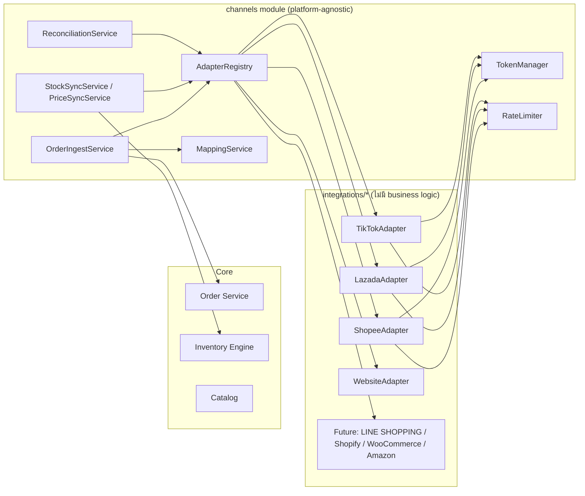
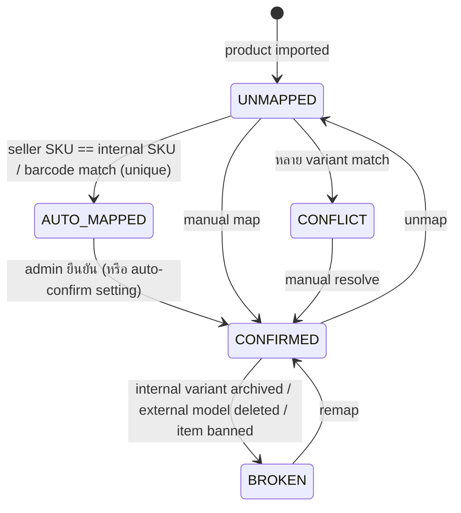

# 06 — Channel Integrations (Adapter Framework, Shopee, Lazada, TikTok, Webhooks)

> ⚠️ **Verify before implement**: endpoint path, token TTL, rate limit, status list และรูปแบบ signature ของ marketplace เปลี่ยนตามเวอร์ชัน API — ค่าที่ระบุในเอกสารนี้คือแนวทางออกแบบ ทีมต้องยืนยันกับ official docs (Shopee Open Platform v2, Lazada Open Platform, TikTok Shop Partner Center) ตอนเริ่ม Phase 6–8 และเก็บค่าทั้งหมดเป็น config ของ adapter ไม่ hard-code ใน core

## 20. Channel Adapter Architecture



**กฎ**: Adapter = **translator + transport** เท่านั้น — แปลง API ของ platform ↔ normalized model; ไม่ตัดสินใจเรื่อง stock/order state. การตัดสินใจทั้งหมดอยู่ใน `channels` module ที่ platform-agnostic → เพิ่ม channel ใหม่ = เขียน adapter + register, **ไม่แตะ core**

### Interface

```ts
// packages/core/src/modules/channels/domain/channel-adapter.ts
export interface ChannelAdapter {
  readonly code: ChannelCode;                       // 'SHOPEE' | 'LAZADA' | 'TIKTOK' | ...
  readonly capabilities: ChannelCapabilities;        // ใช้ตัดสินว่าจะเรียก method ไหนได้

  // --- Auth ---
  buildAuthorizeUrl(ctx: ConnectContext): Promise<string>;
  exchangeCode(ctx: ConnectContext, callback: Record<string, string>): Promise<ChannelTokenSet & { externalShopId: string; shopName?: string }>;
  refreshToken(account: AccountRef, current: ChannelTokenSet): Promise<ChannelTokenSet>;

  // --- Webhook ---
  verifyWebhook(req: RawWebhookRequest): WebhookVerification;           // pure, no I/O
  parseWebhook(req: RawWebhookRequest): ParsedWebhook[];                // → {eventType, externalShopId, externalRef, eventTs, dedupKey}

  // --- Products ---
  listProducts(account: AccountRef, cursor?: string): Promise<Page<ExternalProduct>>;
  getProduct(account: AccountRef, externalItemId: string): Promise<ExternalProduct | null>;

  // --- Orders ---
  listOrders(account: AccountRef, q: { updatedFrom: Date; updatedTo: Date; cursor?: string }): Promise<Page<ExternalOrderRef>>;
  getOrders(account: AccountRef, externalOrderIds: string[]): Promise<NormalizedChannelOrder[]>;   // batch detail
  cancelOrder?(account: AccountRef, externalOrderId: string, reason: CancelReason): Promise<void>;
  shipOrder?(account: AccountRef, req: ShipRequest): Promise<ShipResult>;

  // --- Inventory / Price ---
  updateInventory(account: AccountRef, updates: StockUpdate[]): Promise<StockUpdateResult[]>;   // per-line result (partial success)
  getInventory?(account: AccountRef, refs: ExternalVariantRef[]): Promise<ExternalStock[]>;     // for reconciliation
  updatePrice?(account: AccountRef, updates: PriceUpdate[]): Promise<PriceUpdateResult[]>;
}

export interface ChannelCapabilities {
  webhook: boolean; orderPolling: boolean; stockPush: boolean; stockRead: boolean;
  pricePush: boolean; cancel: boolean; partialShipment: boolean;
  maxStockUpdateBatch: number; maxOrderDetailBatch: number; orderListMaxWindowDays: number;
}

// Normalized model (สิ่งที่ core เห็น)
export interface NormalizedChannelOrder {
  externalOrderId: string;
  externalStatus: string;
  normalizedStatus: NormalizedOrderStatus;        // PENDING | PAID | CONFIRMED | PROCESSING | PACKED | SHIPPED | DELIVERED | COMPLETED | CANCELLED | RETURN_REQUESTED | ...
  updateTime: Date;                               // ★ ใช้ตัดสิน out-of-order
  createdAt: Date; paidAt?: Date;
  buyer: { externalBuyerId?: string; name?: string; phone?: string; email?: string };
  shippingAddress?: Address;
  lines: Array<{ externalLineId: string; externalItemId: string; externalVariantId: string; externalSku?: string;
                 name: string; quantity: string; unitPrice: string; discount: string; lineStatus?: NormalizedOrderStatus }>;
  amounts: { subtotal: string; shippingFee: string; discount: string; platformFees?: string; grandTotal: string; currency: 'THB' };
  packages?: Array<{ externalPackageId: string; lineIds: string[]; trackingNo?: string; carrier?: string }>;
  raw: unknown;
}

export class ChannelError extends Error {
  constructor(
    readonly kind: 'AUTH_EXPIRED' | 'AUTH_REVOKED' | 'RATE_LIMITED' | 'TRANSIENT' | 'NOT_FOUND' |
                   'VALIDATION' | 'PERMANENT' | 'UNKNOWN_OUTCOME',   // UNKNOWN_OUTCOME = timeout หลังส่ง request
    message: string, readonly retryAfterMs?: number, readonly platformCode?: string) { super(message); }
}
```

**Error taxonomy → action** (ใช้ร่วมทุก adapter)
| kind | Action |
|---|---|
| AUTH_EXPIRED | refresh token (single-flight lock) → retry 1 ครั้ง |
| AUTH_REVOKED | account → `TOKEN_EXPIRED`, หยุด job ของ account, แจ้ง Owner ให้ reconnect |
| RATE_LIMITED | requeue ด้วย `retryAfterMs` หรือ backoff, ลด token bucket rate ชั่วคราว (adaptive) |
| TRANSIENT (5xx, network) | exponential backoff + jitter, max attempts ตาม job type → DLQ |
| UNKNOWN_OUTCOME | **ห้ามสมมติว่าล้มเหลว** — สำหรับ stock push: push ซ้ำได้เพราะเป็น absolute value (idempotent โดยธรรมชาติ); สำหรับ cancel/ship: เรียก getOrder ตรวจสถานะก่อน retry |
| VALIDATION / PERMANENT | ไม่ retry → DLQ + แจ้ง (เช่น item ถูกแบน, model ถูกลบ → mapping BROKEN) |

### Shared infrastructure (อยู่ใน channels module, ทุก adapter ใช้)
- **TokenManager**: อ่าน/ถอดรหัส `channel_credentials`; refresh ล่วงหน้า (เมื่อเหลือ < 20% TTL) โดย scheduler; **single-flight** ด้วย Redis lock `lock:token:{account}` + optimistic `version` บน `channel_credentials` (สำคัญเพราะบาง platform **rotate refresh token** — ถ้า 2 worker refresh พร้อมกัน token ชุดหนึ่งจะใช้ไม่ได้)
- **RateLimiter**: Redis token bucket (Lua) key = `rl:{platform}:{app}:{shop}:{apiGroup}` + global per app; ค่าจาก adapter config; BullMQ group rate limit ต่อ shop
- **HttpClient**: timeout (connect 3s, total 10–20s), retry policy ตาม taxonomy, circuit breaker ต่อ (platform, apiGroup) — เปิดเมื่อ error rate > 50% ใน 1 นาที → fail fast 30s, log request/response (redact token/PII) + OTel span
- **OrderIngestService**: webhook/polling → `getOrders` → upsert `channel_orders` (out-of-order guard) → map → OMS
- **StockSyncService**: compute sellable ตาม policy → `updateInventory` batch → บันทึก `last_pushed_*`

---

## 17. Shopee Integration Architecture

| หัวข้อ | Design |
|---|---|
| **Auth** | Partner (app) มี `partner_id` + `partner_key` (Secrets Manager). Shop authorize ผ่าน URL `/api/v2/shop/auth_partner` (signed) → callback ได้ `code` + `shop_id` → `/api/v2/auth/token/get` → `access_token` (อายุสั้น ~4 ชม.) + `refresh_token` (~30 วัน) → refresh ด้วย `/api/v2/auth/access_token/get` ซึ่ง **ออก refresh token ใหม่ทุกครั้ง** → เก็บ atomically |
| **Request signing** | `sign = HMAC-SHA256(partner_key, partner_id + api_path + timestamp + access_token + shop_id)` (hex); ใส่ `partner_id, timestamp, access_token, shop_id, sign` ใน query; timestamp ต้องใกล้เวลาจริง (sync NTP) |
| **Shop** | 1 `channel_accounts` ต่อ `shop_id`; รองรับ main/merchant account หลาย shop |
| **Product/SKU** | `v2.product.get_item_list` (paging) → `get_item_base_info` → `get_model_list` ต่อ item ที่มี variation → `channel_products` (item_id) + `channel_product_variants` (item_id, model_id; no variation → model_id = '') |
| **Mapping** | Internal `SKU-001` ↔ `item_id=12345, model_id=67890` (auto-map ด้วย `model_sku`/`item_sku` == internal SKU) |
| **Order** | Webhook push (order status update) + polling `v2.order.get_order_list` (time_range_field=`update_time`, window ≤ 15 วัน, page) → `v2.order.get_order_detail` (batch ≤ 50 order_sn) |
| **Stock** | `v2.product.update_stock` ต่อ item (หลาย model ต่อ call) ด้วย absolute `seller_stock` |
| **Price** | `v2.product.update_price` (ต่อ model) — ปิดเป็น default (ร้านส่วนใหญ่ตั้งราคาบน Shopee เอง/ร่วม campaign) |
| **Webhook** | Push URL `/webhooks/shopee`; verify: `Authorization` header == HMAC-SHA256(partner_key, `{full_url}|{raw_body}`) (constant-time compare); payload มี `shop_id`, `code` (ประเภท push), `data.ordersn`, `data.status`, `timestamp` |
| **Rate limit** | ต่อ partner + ต่อ shop ตาม API; ตั้ง bucket conservative (config) + adaptive เมื่อเจอ error rate-limit |
| **Retry / Idempotency** | Order ingest idempotent โดย unique (account, order_sn) + inventory movement key; stock push = absolute value → retry ปลอดภัย |

### Shopee status → internal
| Shopee | Internal | Inventory |
|---|---|---|
| `UNPAID` | PENDING | RESERVATION (soft, no TTL — รอ platform cancel) |
| `READY_TO_SHIP` | CONFIRMED (paid) | COMMIT |
| `PROCESSED` | PACKED (arranged shipment) | — |
| `SHIPPED` | SHIPPED | SALE (deduct) |
| `TO_CONFIRM_RECEIVE` | DELIVERED | — |
| `COMPLETED` | COMPLETED | — |
| `IN_CANCEL` | (คงสถานะเดิม + flag `cancel_requested`) | ไม่ปล่อย stock จนกว่าจะ CANCELLED จริง |
| `CANCELLED` | CANCELLED | RELEASE หรือ CANCEL (ตาม bucket ที่ถืออยู่); ถ้า SHIPPED ไปแล้ว → return flow |
| `TO_RETURN` | RETURN_REQUESTED | รอรับของจริงก่อน restock |

### Shopee order → stock flow
```
Shopee Order → Webhook → verify → webhook_events (dedup) → 200
 → worker: resolve tenant by shop_id → get_order_detail (source of truth)
 → Validate (status, amounts, update_time ≥ ที่มีอยู่)
 → Map SKU (item_id, model_id) → variant  [unmapped → ON_HOLD + alert]
 → Reserve/Commit Stock (InventoryEngine, conditional update)  [ไม่พอ → ON_HOLD BACKORDER + OVERSOLD alert]
 → Inventory Ledger (same tx)
 → Update Stock (balance) + outbox StockChanged (same tx)
 → Sync Stock กลับทุก Channel (debounced push jobs)
```

**Shopee-specific gotcha**: Shopee ลด stock บน listing ของตัวเองทันทีเมื่อมี order และคืนเมื่อ cancel. ถ้าเรา push ค่าที่ **ยังไม่ได้หัก order ที่เพิ่งเกิด** (เพราะยัง ingest ไม่ทัน) เราจะ "เติม stock คืน" ให้ Shopee โดยไม่ตั้งใจ → oversell
→ แก้: (1) queue `order-ingest` priority สูงกว่า `stock-push` (2) ก่อน push ของ account ใด ตรวจว่ามี webhook ของ account นั้นค้าง `RECEIVED` อยู่หรือไม่ → ถ้ามี delay push 2–5s (3) safety stock ≥ 1–2 สำหรับ SKU ขายเร็ว

---

## 18. Lazada Integration Architecture

| หัวข้อ | Design |
|---|---|
| **Auth** | `app_key` + `app_secret`; seller authorize → `code` → `/auth/token/create` → `access_token` + `refresh_token` (+ `country_user_info` → seller_id) → refresh ด้วย `/auth/token/refresh`; gateway ประเทศไทย `https://api.lazada.co.th/rest` |
| **Signing** | เรียง parameter ตาม key (ไม่รวม `sign`), ต่อ string = `api_path + k1 + v1 + k2 + v2 ...` → `HMAC-SHA256(app_secret)` → **uppercase hex**; params ระบบ: `app_key, timestamp (ms), sign_method=sha256, access_token` |
| **Product/SKU** | `/products/get` (filter, offset paging) → item_id + skus[] (`SkuId`, `SellerSku`, `ShopSku`) → mapping key = (item_id, SkuId); Lazada มี seller_sku ต่อ SKU → auto-map ง่าย |
| **Order** | Lazada **status อยู่ระดับ order item** (1 order มีหลาย item สถานะต่างกันได้) → adapter ต้อง normalize ต่อ line + derive order status (เช่น ทุก line canceled → CANCELLED; บาง line → partial cancel) ; polling `/orders/get` (`update_after`, `sort_by=updated_at`) + `/orders/items/get` (batch) |
| **Order status (item)** | `unpaid`→PENDING, `pending`→CONFIRMED(COMMIT), `packed`/`ready_to_ship`→PACKED, `shipped`→SHIPPED(SALE), `delivered`→DELIVERED, `failed_delivery`/`returned`→RETURN flow, `canceled`→CANCELLED line (RELEASE/CANCEL ต่อ line) |
| **Inventory** | ใช้ sellable-quantity API (`/product/stock/sellable/update`) ถ้า account รองรับ; fallback `/product/price_quantity/update` (payload XML/JSON ของ Sku list) — ส่ง absolute quantity; รองรับ multi-warehouse code ของ Lazada ถ้าร้านใช้ |
| **Price** | `/product/price_quantity/update` (price, sale_price, sale dates) |
| **Webhook** | Lazada Push Mechanism (ตั้ง callback URL ใน app console) → `/webhooks/lazada`; verify signature จาก header `Authorization` = HMAC-SHA256(app_secret, app_key + raw_body) (ยืนยันกับ docs) ; message types: trade order status, product, reverse order |
| **Token** | expiry อ่านจาก `expires_in`/`refresh_expires_in` ใน response (ไม่ hard-code) |
| **Rate limit** | ต่อ app + ต่อ seller/API; error code rate limit (เช่น `ApiCallLimit`) → RATE_LIMITED |
| **Retry / Error** | เหมือน framework; error response ของ Lazada มาใน HTTP 200 + `code != "0"` → adapter ต้องแปลงเป็น ChannelError ตาม code |
| **Mapping** | (item_id, SkuId) ↔ variant; `quantity_multiplier` สำหรับ listing แพ็ค |

**Partial cancel ตัวอย่าง**: order 3 items, ลูกค้า cancel 1 → webhook → getOrder → line 2 `canceled` → `OrderLineCancelled` → CANCEL/RELEASE เฉพาะ line นั้น (idempotency `order:{id}:line:{lineId}:cancel`) → order ยังเป็น CONFIRMED

---

## 19. TikTok Shop Integration Architecture

| หัวข้อ | Design |
|---|---|
| **Auth** | App (`app_key`, `app_secret`) บน Partner Center; seller authorize → `auth_code` → token endpoint (`/api/v2/token/get`) → `access_token` + `refresh_token` (+ expire timestamps) ; จากนั้นเรียก Get Authorized Shops เพื่อได้ `shop_id` และ **`shop_cipher`** (ต้องส่งทุก shop-level API → เก็บใน `channel_credentials.extra_enc`) |
| **Signing** | `sign = HMAC-SHA256(app_secret, app_secret + path + concat(sorted params ไม่รวม sign/access_token → key+value) + body(ถ้ามี, non-multipart) + app_secret)` hex; access token ส่งใน header `x-tts-access-token`; API แบบ versioned path (เช่น `/order/202309/orders/search`) |
| **Product/SKU** | Search products → product detail → skus[] (`sku_id`, `seller_sku`) → mapping (product_id, sku_id) |
| **Order** | Webhook + polling `orders/search` (update_time_ge/lt, page_token) → get order detail (batch ids) |
| **Order status** | `UNPAID`→PENDING(reserve), `ON_HOLD` (ช่วงที่ผู้ซื้อยังยกเลิกได้หลังจ่าย)→PAID(reserve คงไว้, ยังไม่ commit หรือ commit ตาม setting), `AWAITING_SHIPMENT`→CONFIRMED(COMMIT), `PARTIALLY_SHIPPING`→partial SHIPPED (SALE ต่อ package), `AWAITING_COLLECTION`→PACKED, `IN_TRANSIT`→SHIPPED(SALE ถ้ายังไม่ตัด), `DELIVERED`→DELIVERED, `COMPLETED`→COMPLETED, `CANCELLED`→CANCELLED |
| **Inventory** | Update inventory ต่อ product (`/product/{version}/products/{product_id}/inventory/update`) body = skus[{id, inventory:[{warehouse_id, quantity}]}] → ต้อง map TikTok warehouse_id ของร้าน |
| **Price** | Update price ต่อ product/sku |
| **Webhook** | `/webhooks/tiktok`; **Signature verification**: header `Authorization` == HMAC-SHA256(app_secret, app_key + raw_body) → constant-time compare; payload มี `type` (เช่น ORDER_STATUS_CHANGE), `shop_id`, `timestamp`, `data.order_id`, `data.order_status`, `data.update_time` → reject ถ้า timestamp เก่ากว่า 5 นาที (replay) หลัง dedupe |
| **Rate limit** | QPS ต่อ app/shop/API → token bucket |
| **Retry / Idempotency** | framework เดียวกัน; dedup key = `sha256(shop_id|type|order_id|update_time|status)` |

**Split / combined packages**: TikTok และ Shopee อาจแยก/รวม package → `fulfillments.channel_package_id` + `fulfillment_items` → SALE ตัดตาม package ที่ส่งจริง (idempotency ต่อ package)

---

## 21. Webhook Architecture (Inbox Pattern §34)

```mermaid
sequenceDiagram
    autonumber
    participant P as Platform
    participant G as webhook-gateway
    participant DB as Postgres (webhook_events)
    participant D as dispatcher
    participant Q as Queue (webhook-process)
    participant W as worker
    P->>G: POST /webhooks/{platform} (raw body)
    G->>G: size limit 1MB, content-type, verify signature (raw bytes, constant-time)
    alt invalid signature
        G->>DB: INSERT (signature_valid=false, status=IGNORED) — เก็บไว้สืบสวน, rate-limited
        G-->>P: 401
    else valid
        G->>G: parse → [ {eventType, shopId, ref, eventTs, dedupKey} ]
        G->>DB: INSERT ... ON CONFLICT (channel_code, dedup_key) DO NOTHING
        G-->>P: 200 (แม้เป็น duplicate)
    end
    D->>DB: SELECT ... WHERE status IN (RECEIVED, FAILED) AND next_attempt_at<=now() FOR UPDATE SKIP LOCKED LIMIT 100
    D->>Q: enqueue {webhookEventId} (jobId = webhookEventId → ไม่ซ้ำ)
    Q->>W: process
    W->>DB: status=PROCESSING, attempts+1
    W->>W: resolve tenant (channel_code, shop_id) → handler ตาม eventType
    W->>DB: [tenant tx] business logic (idempotent)
    W->>DB: status=PROCESSED
    Note over W,DB: error → FAILED + next_attempt_at (backoff) ; attempts > 10 → DEAD + alert
```

| ปัญหา | วิธีรับมือ |
|---|---|
| **Duplicate webhook** | `UNIQUE(channel_code, dedup_key)` ที่ gateway + business idempotency (orders unique, movement key) ชั้นที่ 2 |
| **Out-of-order** | webhook เป็นแค่ "สัญญาณ" → worker **ดึงสถานะล่าสุดจาก API เสมอ**; `channel_orders.external_update_time`: ถ้า update_time ที่ได้ ≤ ที่มีอยู่ → ignore; state machine อนุญาต "กระโดดไปข้างหน้า" (เช่น ได้ SHIPPED ก่อน READY_TO_SHIP → apply effect ที่ขาดตามลำดับ: COMMIT แล้ว SALE ใน tx เดียว) แต่ไม่ถอยหลัง |
| **Missing webhook** | Polling job ต่อ account ทุก 5 นาที (incremental: `updatedFrom = last_order_sync_at − 10 นาที overlap`) + daily full sweep 3 วันย้อนหลัง → order ที่ webhook หายจะถูกเก็บโดย polling (idempotent อยู่แล้ว) |
| **Retry** | backoff: 10s, 30s, 1m, 5m, 15m, 1h ... (max 10) |
| **Failed event** | status DEAD → Admin console: ดู payload/error, "Retry", "Retry all for account", "Ignore" (+ reason, audit) |
| **Unknown shop** | tenant_id null → status IGNORED + alert platform ops (อาจเป็น shop ที่ disconnect แล้ว) |
| **Gateway ล่ม** | platform จะ retry ตามนโยบายของเขา + polling ของเราเก็บตก; gateway แยก process/scale อิสระจาก API |
| **Replay attack** | signature + timestamp tolerance (ถ้ามี) + dedup key |
| **Archive** | PROCESSED > 30 วัน → S3 (Parquet, partition by date/platform) → ลบจาก DB; replay จาก S3 ได้ |

**Raw body**: Fastify ต้องตั้ง `addContentTypeParser` ให้เก็บ raw Buffer ก่อน parse — signature ต้องคำนวณจาก bytes ดิบ ไม่ใช่ JSON ที่ re-serialize

---

## SKU Mapping Lifecycle


- Push stock เฉพาะ `AUTO_MAPPED`(ถ้า setting อนุญาต) และ `CONFIRMED`; `BROKEN` → หยุด push + alert; internal variant ถูก archive → push 0 ครั้งสุดท้ายก่อนตัด mapping
- เปลี่ยน mapping → audit log (before/after) + **re-process order ที่ ON_HOLD (UNMAPPED_SKU)** ของ listing นั้นอัตโนมัติ
- Mapping ผิด (map ไป variant ผิดตัว) ตรวจพบภายหลัง → remap ไม่แก้ order เก่าอัตโนมัติ; มีเครื่องมือ "Re-assign order lines" ที่ทำ compensating movements (RELEASE variant ผิด + RESERVE variant ถูก) — ดู edge case #7
- Bulk: export/import Excel mapping sheet
