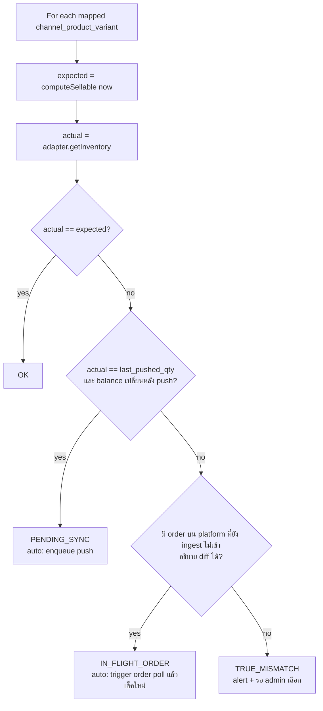

# 10 — Reconciliation, Error Handling, Edge Cases

## 27. Reconciliation

มี 4 ชนิด (`reconciliation_runs.type`)

| ชนิด | เทียบ | ความถี่ | Auto-fix? |
|---|---|---|---|
| **LEDGER_BALANCE** | `inventory_balances` vs Σ ledger | ทุกคืน + หลัง incident | ❌ alert CRITICAL → rebuild (manual, ดู [13](13-dr-and-operations.md)) |
| **CHANNEL_STOCK** | computed sellable vs stock บน Shopee/Lazada/TikTok | ทุกชั่วโมง (SKU ขายเร็ว/available ต่ำ) + ทุกคืน (ทั้งหมด) | ✅ เฉพาะกรณีปลอดภัย (ด้านล่าง) |
| **ORDER** | order บน platform (list 3 วันย้อนหลัง) vs `channel_orders` | ทุกคืน | ✅ ingest ที่ขาด (idempotent) |
| **PAYMENT** | payment gateway settlement vs `payments` | ทุกวัน | ❌ report |

### Channel Stock Reconciliation

ตัวอย่าง: Internal = 50, Shopee = 48 → ระบบตรวจ 2 order ที่ Shopee หักไปแล้วแต่เรายังไม่ ingest? → ถ้าใช่ = IN_FLIGHT (แก้เอง) → ไม่ใช่ = `Stock mismatch` → Admin เลือก:

**Option A — Push Internal → Channel** (default, ปลอดภัยกว่า)
- เขียนทับ stock บน channel ด้วย computed sellable
- **Safety rules**:
  1. ถ้า push จะ **เพิ่ม** stock บน channel มากกว่า `max(10, 50%)` ของค่าเดิม → ต้องยืนยัน (อาจเป็น internal ผิด เช่น รับของซ้ำ)
  2. ห้าม push ขณะ account มี webhook ค้าง/ order ingest ค้าง → รอให้เคลียร์ก่อน
  3. ใช้ค่าที่ compute ณ เวลา push (ไม่ใช่ตอนสร้าง report)

**Option B — Pull Channel → Internal** (อันตราย — ใช้เมื่อเชื่อว่า channel ถูก เช่น ร้านนับของแล้วแก้บน Shopee)
- **ไม่แก้ balance ตรง** → สร้าง `stock_adjustment` (source = RECONCILIATION, reason COUNT_ERROR) สถานะ **PENDING_APPROVAL** ที่คำนวณ delta ย้อนกลับจาก policy:
  `new_on_hand = actual_channel / (1 − buffer%) + safety + reserved + committed` (ปัด) → delta = new − current
- **ใช้ได้เฉพาะ** เมื่อ mapping 1:1, `quantity_multiplier = 1`, GLOBAL_POOL, channel ขายจาก **คลังเดียว**, ไม่ใช่ bundle — ไม่เช่นนั้นย้อนกลับไม่ได้อย่างมีความหมาย → UI disable พร้อมเหตุผล
- |delta| > threshold (เช่น 20 ชิ้น หรือ ฿5,000) → ต้อง approver อีกคน
- Preview ก่อนยืนยัน: before/after ของทุก channel ที่จะได้รับผล (เพราะ pull ไป internal → push ออกไปทุก channel อื่นด้วย)
- Bulk pull จำกัด 100 SKU/ครั้ง

ทุก resolution → `reconciliation_items.resolution` + audit log

## 28. Error Handling Matrix (§44)

| กรณี | ตรวจจับ | Retry / Backoff | DLQ | Alert | Manual action |
|---|---|---|---|---|---|
| **Shopee/Lazada/TikTok API down** | 5xx/timeout, circuit breaker open | exp backoff 5s→10m, max 8–10 | ✅ | circuit open > 5 นาที → WARNING; > 30 นาที → CRITICAL + banner ใน UI "Shopee sync ล่าช้า" | "Retry all for account" |
| **API timeout** | `UNKNOWN_OUTCOME` | stock push: retry ตรง (absolute, idempotent); ship/cancel: getOrder ตรวจก่อน retry | ✅ | rate > 5% | |
| **Webhook duplicate** | unique dedup_key | — (ignore) | — | metric only | — |
| **Webhook missing** | polling พบ order ที่ไม่มี webhook | — | — | ถ้า > 10% ของ order มาจาก polling → WARNING (webhook config เสีย?) | ตรวจ push config |
| **Token expired** | `AUTH_EXPIRED` | refresh (single-flight) + retry 1 | — | — | — |
| **Token revoked / refresh expired** | `AUTH_REVOKED` | ❌ หยุด account | jobs พัก (ไม่ทิ้ง) | CRITICAL ถึง Owner (email+LINE) + ล่วงหน้า 7/3/1 วันก่อน refresh หมดอายุ | Reconnect → jobs ที่พักรันต่อ |
| **Rate limit** | 429 / platform code | `Retry-After` หรือ exp; adaptive ลด rate 50% 5 นาที | ถ้าครบ attempts | sustained > 15 นาที | เพิ่ม quota กับ platform |
| **Database deadlock** | `40P01` | retry ทั้ง tx 3 ครั้ง jitter 10–50ms | — | rate > 0.1% → WARNING (lock order ผิด = bug) | fix code |
| **Serialization / lock timeout** | `40001`, `55P03` | เหมือนข้างบน | — | | |
| **DB failover** | connection error | pool reconnect, request retry (idempotent เท่านั้น) | — | CRITICAL (infra) | |
| **Queue (Redis) failure** | enqueue error | producer: ไม่ใช้ Redis เป็น source of truth — outbox/webhook_events ยังอยู่ใน Postgres → relay ส่งใหม่เมื่อ Redis กลับ | — | CRITICAL | ตรวจ queue depth หลังกลับ |
| **Network failure (POS)** | fetch error | local outbox, backoff 1s→5m | — | device offline > 30 นาที → แจ้ง manager | |
| **Order duplicated** | unique violation | treat as success (return existing) | — | metric | — |
| **SKU mapping missing** | lookup null | ❌ | — | order ON_HOLD + WARNING (รวม digest ทุก 15 นาที) | map SKU → auto re-process held orders |
| **Stock insufficient (marketplace)** | guard fail | ❌ | — | **CRITICAL OVERSOLD** | หาของ/transfer/cancel |
| **Stock insufficient (POS/web)** | guard fail | ❌ → 409 | — | — | manager override |
| **Worker crash** | stalled job | BullMQ re-queue อัตโนมัติ (idempotent) | ถ้า stalled > maxStalledCount | | |
| **Poison message** (payload parse fail) | validation error | ❌ ไม่ retry | ✅ ทันที | WARNING | แก้ adapter → replay |

**Backoff มาตรฐาน**: `delay = min(cap, base × 2^attempt) × random(0.5, 1.0)` (full jitter)

**Manual retry**: Admin console → Sync Jobs / Webhooks / DLQ → filter (tenant, account, error) → Retry one / Retry selected / Retry all (rate-limited) → ทุก retry ใช้ idempotency เดิม จึงปลอดภัย

## 59. Edge Cases (25 กรณี)

| # | กรณี | วิธีแก้ |
|---|---|---|
| 1 | **ลูกค้าซื้อ Shopee พร้อม POS** (stock เหลือ 1) | Conditional atomic UPDATE + row lock → ผู้มาก่อน (commit ก่อน) ได้; POS ที่แพ้ได้ 409 ก่อนรับเงิน. ถ้า Shopee แพ้ (POS ตัดไปแล้ว) → Shopee order ON_HOLD BACKORDER + OVERSOLD alert + push 0 ไป Shopee ทันที. ลดโอกาสด้วย safety stock/allocation |
| 2 | **Webhook มา 2 ครั้ง** | ชั้น 1: `UNIQUE(channel, dedup_key)`; ชั้น 2: order unique (account, order_sn); ชั้น 3: movement idempotency key → ไม่มีทางตัด stock ซ้ำ |
| 3 | **Webhook มาไม่เรียงลำดับ** | ไม่เชื่อ payload → getOrder ล่าสุด; เทียบ `external_update_time`; state machine เดินหน้าอย่างเดียว และเติม effect ที่ข้ามไป (เช่น ได้ SHIPPED ก่อน CONFIRMED → COMMIT+SALE ใน tx เดียว) |
| 4 | **API Marketplace ล่ม** | circuit breaker, jobs ค้างใน queue/DB (ไม่หาย), backoff; order ที่พลาด webhook เก็บด้วย polling เมื่อกลับมา; stock push ใหม่ใช้ค่าล่าสุด (coalesced) → ไม่ต้อง replay ทุก event; UI แสดงสถานะ degraded |
| 5 | **Token หมดอายุ** | refresh ล่วงหน้า (< 20% TTL) + on-demand เมื่อเจอ AUTH_EXPIRED (single-flight lock + version); refresh token หมด → account TOKEN_EXPIRED, jobs paused, แจ้ง Owner ล่วงหน้า |
| 6 | **SKU ถูกลบ** | ฝั่งเรา: soft delete เท่านั้น (ledger อ้างอิง); ห้ามลบถ้า stock ≠ 0 หรือมี order เปิด; mapping → BROKEN + push 0 ครั้งสุดท้าย. ฝั่ง platform: product sync/ error `NOT_FOUND` ตอน push → mapping BROKEN + alert; order เก่ายังอ้าง variant ได้ตามปกติ |
| 7 | **SKU Mapping ผิด** | ป้องกัน: auto-map ต้อง unique match, CONFLICT ต้องคนเลือก, preview (ชื่อ/รูป/option) ก่อน confirm. แก้: remap (audit) + เครื่องมือ "Re-assign order lines" สำหรับ order ที่ยังไม่ส่ง → movement ชดเชย (RELEASE/CANCEL variant ผิด → RESERVE/COMMIT variant ถูก) ใน tx เดียว; order ที่ส่งแล้ว → adjustment ทั้ง 2 variant (ของออกจริงคือตัวไหน ต้องให้คนยืนยัน) |
| 8 | **Order ถูก Cancel หลัง Reserve** | RELEASE (ถ้ายัง RESERVED) หรือ CANCEL (ถ้า COMMITTED) ด้วย key `order:{id}:release` → idempotent; ถ้า cancel มาก่อน reserve (out-of-order) → state CANCELLED แล้ว reserve จะไม่เกิด (state machine ปฏิเสธ) |
| 9 | **Refund หลัง Shipment** | refund = เรื่องเงิน ไม่แตะ stock; stock กลับเข้าเมื่อ **รับของคืนจริง + QC** (RETURN → ON_HAND หรือ DAMAGED); refund-only (ไม่ต้องคืนของ) → ไม่มี stock movement แต่บันทึก COGS/loss ใน report |
| 10 | **Partial Refund** | `refund_items` ระบุ line/qty/amount; `order_items.refunded_amount` สะสม + CHECK ไม่เกิน; order → PARTIALLY_REFUNDED; loyalty points reverse ตามสัดส่วน; ใบลดหนี้ออกเฉพาะส่วน |
| 11 | **Partial Shipment** | `fulfillments` หลาย package; SALE ต่อ fulfillment item (key `fulfillment:{id}:ship`); reservation `fulfilled_qty` เพิ่ม; ส่วนที่ยังไม่ส่งยัง COMMITTED; order `fulfillment_status = PARTIALLY_FULFILLED` |
| 12 | **Product หลาย Variant** | stock อยู่ระดับ variant เสมอ; mapping ระดับ (item, model/sku); product-level report = aggregate; push ต่อ item รวม model หลายตัวใน call เดียว |
| 13 | **Bundle Product** | bundle ไม่มี balance; order line bundle → reservation/SALE ของ components (qty × ratio) ใน movement เดียว; bundle sellable = min(component sellable / ratio); component เปลี่ยน → push ทั้ง component listing และ bundle listing (ตาม reverse index `bundle_components`) |
| 14 | **Stock อยู่หลาย Warehouse** | balance ต่อคลัง; channel ขายจาก `channel_warehouses`; sellable = Σ; FulfillmentRouter เลือกคลังตาม priority ที่พอทั้ง order → split ถ้าอนุญาต → BACKORDER |
| 15 | **Transfer ระหว่าง Warehouse** | APPROVED → COMMIT ที่ต้นทาง (กันขาย), SHIPPED → TRANSFER_OUT + INCOMING ปลายทาง, RECEIVED → TRANSFER_IN; partial/damaged/ขาด → แยก bucket + LOSS ที่ TRANSIT; ระหว่างทางไม่นับใน sellable ของใคร |
| 16 | **POS Offline** | local-first: ขายได้, ใบเสร็จเลขจาก device seq, outbox; stock snapshot ใช้เตือนเท่านั้น; server เพิ่ม offline buffer ให้ channel ที่ใช้คลังเดียวกัน |
| 17 | **POS Online กลับมาแล้ว Stock ไม่ตรง** | sync ตาม seq → SALE apply ด้วย allowNegative (ความจริงกายภาพชนะ) → ถ้า available < 0: (a) marketplace order ที่ยัง COMMITTED ของ SKU นั้นถูก flag `AT_RISK` ตาม FIFO ของเวลาสั่ง (b) push stock ใหม่ทันที (c) alert NEGATIVE_STOCK + spot count task |
| 18 | **Stock Count พบ Stock หาย** | variance = counted − (snapshot + movement since) → recount ถ้าเกิน tolerance → approve (SoD) → COUNT_VARIANCE; ถ้า on_hand ใหม่ < reserved+committed → OVERCOMMITTED alert + order ที่ยังไม่ pick ถูก flag; รายงาน shrinkage |
| 19 | **Concurrent Order** (หลาย line, หลาย SKU) | lock ordering (sort wh,variant) กัน deadlock; all-or-nothing ต่อ order; retry เมื่อ deadlock; hot SKU → reservation buckets (S3) |
| 20 | **DB transaction fail กลางทาง** | ทุกอย่าง (order + balance + ledger + reservation + outbox) อยู่ใน tx เดียว → rollback ทั้งหมด; ไม่มี external call ใน tx → ไม่มีสถานะครึ่ง ๆ; caller retry ด้วย idempotency key เดิม |
| 21 | **Queue job รันซ้ำ** | handler idempotent: `processed_events` / natural keys / movement key / absolute stock push |
| 22 | **Worker crash** | job stalled → requeue; tx ที่ค้างถูก Postgres rollback เมื่อ connection หลุด; external call ที่ทำไปแล้ว (เช่น push) → ทำซ้ำได้เพราะ idempotent/absolute; ship/cancel → ตรวจสถานะก่อนทำซ้ำ |
| 23 | **Channel stock update สำเร็จแต่ response หาย** | UNKNOWN_OUTCOME → retry push ค่า absolute ล่าสุด (ปลอดภัย); ไม่ update `last_pushed_*` จนกว่าจะได้ ack; reconciliation จับได้ถ้ายังคลาด |
| 24 | **Internal stock update สำเร็จแต่ Channel update fail** | internal เป็น source of truth → push เป็น async job พร้อม retry/DLQ; ระหว่างนั้น channel แสดงค่าเก่า (risk oversell ถ้าลดลง) → priority สูงสำหรับการ push ที่ **ลด** stock/เป็น 0; circuit ล่มนาน → alert + (option) auto-pause listing ผ่าน API อื่นเมื่อกลับมา |
| 25 | **Channel update สำเร็จแต่ internal transaction rollback** | **เกิดไม่ได้โดย design**: ห้ามเรียก channel ภายใน tx — push เกิดหลัง commit ผ่าน outbox เท่านั้น. ถ้า tx rollback → ไม่มี outbox event → ไม่มี push. (กรณีกลับด้าน: เราสั่ง cancel/ship บน platform ต้องเรียก API ก่อน แล้วบันทึกผลใน tx แยก; ถ้าบันทึกล้ม → webhook/poll ของ platform จะนำสถานะจริงกลับมา (self-healing) + job `order-status-push` ตรวจสถานะก่อนทำซ้ำ) |
