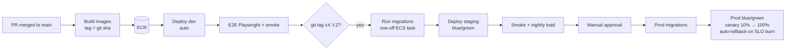

# 16 — Engineering Handbook (Conventions, Git, Env, Docker, Local Dev, CI/CD)

## Coding Conventions

### TypeScript
- `strict: true`, `noUncheckedIndexedAccess`, `exactOptionalPropertyTypes`; ห้าม `any` (ใช้ `unknown` + zod parse)
- **Money/quantity**: `Decimal` (decimal.js) เท่านั้น — lint ห้าม arithmetic operator กับ field ชื่อ `*amount|*price|*total|*qty|quantity`; serialize เป็น string
- **ID**: `uuidv7()` จาก `packages/shared/ids`; branded types (`type VariantId = Brand<string,'VariantId'>`) กันส่ง id ผิดชนิด
- **Time**: เก็บ/ส่ง UTC; `Clock` interface inject ได้ (test ได้); แสดงผลตาม `tenant.timezone`
- **Errors**: domain errors extends `DomainError` มี `code` คงที่ (map → HTTP ใน filter เดียว); ห้าม throw string
- **Result ของ external calls**: adapter คืน `ChannelError` ตาม taxonomy — ห้ามปล่อย axios/fetch error ขึ้นไป
- **Transactions**: เปิด tx ได้ที่ application layer (use case) เท่านั้น; repository รับ `tx` เป็น argument; ห้ามเรียก HTTP/queue ภายใน tx (ยกเว้น `outbox.add(tx, …)`)
- **SQL**: Kysely หรือ `sql` tagged template เท่านั้น; dynamic identifiers ผ่าน whitelist
- **Naming**: files `kebab-case.ts`; classes `PascalCase`; DB `snake_case`; JSON `camelCase`; events `PastTense` (`OrderCancelled`); permissions `resource.action`; queue names `kebab-case`; idempotency keys `{aggregate}:{id}:{action}[:v]`
- **Module public API**: export ผ่าน `public-api.ts` เท่านั้น (`eslint-plugin-boundaries`)
- **Validation**: zod schemas ใน `packages/contracts` (shared กับ FE/POS)
- **Logging**: `logger.info({ event: 'inventory.movement.applied', ... })` — event name เป็น snake/dot, ห้าม log PII/token
- **Tests**: `*.spec.ts` ข้างไฟล์ (unit), `tests/integration/**`, `tests/concurrency/**`; ห้าม mock database ใน integration test (ใช้ embedded PostgreSQL ผ่าน `tests/support`)
- **Frontend**: TanStack Query สำหรับ server state; form = react-hook-form + zod; i18n (th/en) ทุกข้อความ; ห้ามคำนวณราคาใน component (ใช้ pos-engine)

### Formatting / Lint
Prettier (printWidth 110), ESLint (typescript-eslint strict, boundaries, import/order, no-floating-promises), commitlint, lint-staged + husky pre-commit

## Git Strategy

- **Trunk-based development**: `main` = deployable เสมอ; feature branch อายุสั้น (≤ 3 วัน) → PR → squash merge
- Branch naming: `feat/INV-3-inventory-engine`, `fix/CHN-42-shopee-token-race`, `chore/...`
- **Conventional Commits**: `feat(inventory): add reservation expiry job` → ใช้ generate changelog + semver
- PR: template (what/why/how tested/risk/rollback), CI เขียว, review ตาม DoD, CODEOWNERS:
  ```
  /packages/core/src/modules/inventory/  @stockos/inventory-owners
  /packages/core/src/modules/orders/     @stockos/inventory-owners
  /packages/database/migrations/         @stockos/db-owners
  /packages/core/src/modules/auth/       @stockos/security-owners
  ```
- Feature flags (Unleash/GrowthBook หรือ table-based) แทน long-lived branches
- Release: merge main → auto deploy `dev`; tag `vX.Y.Z` → deploy `staging` → manual approval → `prod`; hotfix = PR เข้า main + tag patch (ไม่มี release branch เว้นแต่ POS app store builds)
- POS app versioning: semver + `min_supported_version` จาก server (บังคับ update ถ้าต่ำกว่า); sync protocol มี version

## Environment Variables
ดูทั้งหมดใน [.env.example](../.env.example). หลักการ:
- Local: `.env` (gitignored); dev/staging/prod: **ECS task definition อ้าง Secrets Manager/SSM** — ไม่มี secret ใน image
- Validate ตอนบูตด้วย zod (`packages/config/env.ts`) → บูตไม่ขึ้นถ้าขาด/ผิด
- แยก `PUBLIC_*` (ส่งไป browser ได้) ชัดเจน

## Docker Setup
- [docker-compose.yml](../docker-compose.yml): postgres 16 (+ pg_partman preload ไม่จำเป็นใน local), redis 7, minio, mailpit, otel-collector, jaeger, prometheus, grafana, marketplace-mock (เมื่อพร้อม)
- Production image (ต่อ app): multi-stage Dockerfile
  ```dockerfile
  FROM node:22-alpine AS base
  RUN corepack enable
  WORKDIR /repo

  FROM base AS deps
  COPY pnpm-lock.yaml pnpm-workspace.yaml ./
  COPY . .
  RUN pnpm install --frozen-lockfile

  FROM deps AS build
  ARG APP
  RUN pnpm turbo run build --filter=@stockos/${APP}... && pnpm deploy --filter=@stockos/${APP} --prod /out

  FROM node:22-alpine AS runtime
  ENV NODE_ENV=production
  RUN addgroup -S app && adduser -S app -G app
  WORKDIR /app
  COPY --from=build /out .
  USER app
  EXPOSE 3000
  CMD ["node", "dist/main.js"]
  ```
  image เดียวกันใช้ได้กับ api/worker/scheduler (ต่าง `CMD`) หรือ build แยกต่อ app

## Local Development Setup
```bash
# prerequisites: Node 22, pnpm 9, Docker
git clone git@github.com:<org>/stockos.git && cd stockos
cp .env.example .env
docker compose up -d                 # postgres, redis, minio, mailpit, observability
pnpm install
pnpm db:migrate && pnpm db:local-roles
pnpm build && pnpm --filter @stockos/api dev   # api:3000 (web/pos/worker apps มาใน phase ถัดไป)
```
- Marketplace dev (Phase 6 — ยังไม่มี): `pnpm mock:marketplaces` (mock server พร้อม signed webhook generator) — ไม่ต้องใช้ sandbox จริงระหว่างพัฒนา; ทดสอบ webhook จริงผ่าน tunnel (cloudflared) ไป `webhook-gateway` เฉพาะตอน integration
- URLs: API docs `http://localhost:3000/docs`, Bull Board `http://localhost:3000/admin/queues`, Mailpit `http://localhost:8025`, MinIO `http://localhost:9001`, Jaeger `http://localhost:16686`, Grafana `http://localhost:3300`
- Useful: `pnpm test` (unit), `pnpm test:int`, `pnpm test:concurrency`, `pnpm db:status`, `pnpm lint`, `pnpm typecheck` (แผน: `gen:types` จาก kysely-codegen, `gen:openapi`)

## CI/CD

### CI (ทุก PR) — [.github/workflows/ci.yml](../.github/workflows/ci.yml)
1. install (pnpm cache) → 2. lint + typecheck + boundaries → 3. unit + property tests → 4. integration (service containers Postgres/Redis) + migrations check (apply บน DB เปล่า + `schema diff` กับ snapshot) → 5. **concurrency suite** → 6. build ทุก app (turbo cache) → 7. security: gitleaks, `pnpm audit --prod`, Trivy (image), CodeQL (weekly) → 8. OpenAPI diff (breaking change → ต้อง label `api-breaking`)

### CD

- Migrations: expand/contract; รันก่อน deploy code; migration ที่ใช้เวลานาน (backfill) เป็น background job แยก
- Rollback: blue/green switch back (code); migration ต้อง backward compatible จึง rollback code ได้โดยไม่ต้อง rollback DB
- POS: web PWA deploy พร้อม web (service worker update prompt ตอนไม่มีบิลค้าง); Tauri/Capacitor builds ผ่าน separate workflow (code signing, Play Store/MDM, auto-updater)
- Infra: Terraform plan บน PR (`infra/**`), apply หลัง approve
